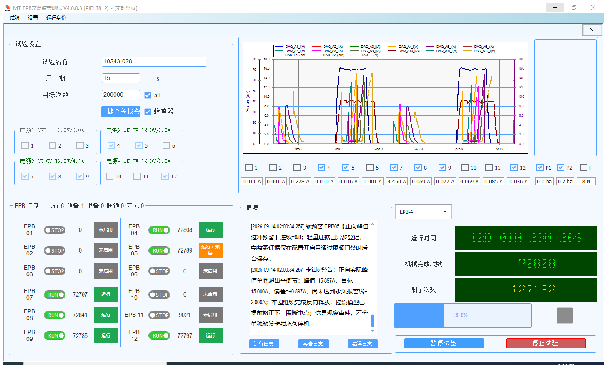

# WJ-EPB V4.0.0.3 完整换版与续测记录

日期：2026-09-14，北京时间。项目：10243-028。

**截至02:05，本次完整换版和正常启动续测验收通过：六通道均Running，每通道已形成27次正式提交，数据库及采集落盘进度持续推进。程序继续留在现场运行。** 这不等于已经完成故障强杀恢复或长期无人耐久验收。

用户明确授权退出正在运行的旧程序、完整卸载、安装新版并续测。本次实际项目目录是 `D:\EPB_Data\10243-028`，没有改用历史描述中的其他目录。

## 版本与安装包

| 项目 | 身份 |
|---|---|
| 旧现场版本 | 4.0.0.1，主程序 PID 23212 |
| 新版本 | 4.0.0.3，候选标签 `v4.0.0.3-rc.1` |
| 构建源码提交 | `a9865b8e8ddd40d8a14a2fa8f912b08b6f96c743`，构建时工作树干净 |
| 新主程序 | `C:\Program Files (x86)\MTTFTest\Current\MTTFTest.exe`，PID 3812 |
| 现场一键包目录 | `D:\debug\V4.0.0.3_a9865b8e8ddd_AUTO_RECOVERY_ONECLICK` |
| 压缩文件 | 同目录名加 `.7z`，34,385,829 字节 |
| 压缩设置 | 7-Zip，LZMA2，`-mx=9`，保留一键包目录结构 |

压缩包 SHA-256：

```text
1A4EA143B44C7C4F99E944FD91174F4D08838014F1F0D255E4D4D352F7FCFB20
```

现场主程序 SHA-256 与本地 Base 完全一致：

```text
F88F111D19B2E58A31825FCE1F2D8750A7F44BEC50054D4526591899C8280EF0
```

本地包位于 `D:\Github\wanxiang\EPBTest\Codex\deploy-v403-20260914`。发布身份仍保留候选标记；用户授权本次部署不等于已经完成长期耐久或故障注入验收。

## 本地与传输验证

- Release AdaptiveControl 758/758、EpbDiskWriter 58/58、PowerSupplyDebugger 19/19，通过。
- 发布门禁 Python 单元测试49项及部署脚本契约检查通过。
- FallbackGuard 单独构建 Release，平台配置 AnyCPU、实际 PlatformTarget 为 x86；包内协议 DLL 与 Base 同源。
- 7-Zip 完整性测试通过。SMB 流式传输用时约102秒，上限180秒、文件上限64MiB。
- 在 WJ-EPB 再次核验压缩包 SHA-256，解压后145项文件清单校验通过，才开始停机换版。

## 实际换版顺序

1. 保留旧试验运行，完成现场状态、界面及两次数据库只读查询。01:37两次采样中六通道均有新 completed 记录。
2. 从旧一键包目录调用独立监控卸载入口。第一次提示“已持久禁用；仍在交还”，没有跳过事务，也没有改写账本。待进程退出后再次调用成功。
3. 经界面点击“停止试验”。01:49:22当前会话产生人工停止回执：MotorsOff、PowerOff、PressureSafe、PersistenceDrained、LogicalQuiescent及FinalSafetyResultCommitted均为true，RelaunchDisposition为Forbidden。
4. 请求关闭旧主程序。确认主程序不存在后，保存最终11份现场XML配置及逐文件SHA-256。
5. 使用新版包的卸载入口，删除旧安装目录、监督服务、登录代理任务、主程序登录启动任务及安装快捷方式。卸载结果明确为目录不存在、服务与两项任务NotInstalled。
6. 安装新版，监督服务及SessionAgent启动。安装后11份配置的SHA-256逐一未变，项目数据库及原始数据未删除，计数未重置。
7. 重新安装独立FallbackGuard常驻任务，任务主体为交互用户、RunLevel为Highest。新Guard路径指向新版一键包的FallbackGuard目录。
8. 打开新主程序，通过“试验→实时监视”加载10243-028，再通过界面“开始试验”续测。沿用15秒周期、10圈自学习和原目标200000。
9. 自学习期间机械计数先推进，正式数据库记录仍停留在停机前，未将这一阶段写成正式续测验收通过。随后核对正式动作、机械计数、completed记录及采集落盘。

旧一键包、封盘证据和ProgramData保留作回退及追溯用途；“完整卸载”没有扩大为删除现场项目或旧备份。

## 续测证据

新会话：`e8ec450745f949e6846ca350696c682c`；新RunId：`03fe8d96a18d4777b65a2d9af3081851`，RunEpoch=1。

启动前机械计数：4=72788、5=72769、7=72777、8=72821、9=72765、12=72777。新程序载入的这些值与停机保存结果相符，未清零。

02:05:00独立主程序状态快照（`final-business-status.json`）：

| 通道 | 启动前机械计数 | 02:05机械计数 | 增量 | 正式提交序号 | 状态 |
|---|---:|---:|---:|---:|---|
| 4 | 72788 | 72825 | +37 | 27 | Running |
| 5 | 72769 | 72806 | +37 | 27 | Running |
| 7 | 72777 | 72814 | +37 | 27 | Running |
| 8 | 72821 | 72858 | +37 | 27 | Running |
| 9 | 72765 | 72802 | +37 | 27 | Running |
| 12 | 72777 | 72814 | +37 | 27 | Running |

同一PID、RunId下各通道DoCommandSequence由01:56快照的11推进到78。Phase=Formal、Armed=true；01:55落盘字段Persisted.Dev1/Dev2均为7455，02:05分别为62998/62995。

另用独立SQLite只读子进程读取真实completed记录，证据任务`Codex-Wj403-743413b657724e89bb6f3c5e15053240`：

| 通道 | 第一次cycle_number | 约16秒后第二次 | 增量 |
|---|---:|---:|---:|
| 4 | 71899 | 71900 | +1 |
| 5 | 71903 | 71904 | +1 |
| 7 | 71790 | 71791 | +1 |
| 8 | 71825 | 71826 | +1 |
| 9 | 71786 | 71787 | +1 |
| 12 | 71821 | 71822 | +1 |

两次EPB4最新完成时间分别为01:58:55和01:59:10。机械计数与数据库cycle_number分别比较自身增量，不混用两种计数的绝对值。

独立Guard PID20648，程序路径为新版包；会话设置Enabled=true、Active=true。02:01:48数据库监督状态为DatabaseObserving、ManualStopped=false、OriginalResponsive=true，目标通道完整包含4/5/7/8/9/12。常驻任务、SessionAgent任务均Running且Highest，主程序登录启动任务Ready且Highest，Supervisor服务Running。

02:00界面为运行6、预警1、报警0、联锁0：EPB5正向峰值15.897A相对目标15A出现平衡带软预警，未达到界面所示永久报警线，未造成停机。未修改预警或报警阈值；02:05六通道仍Running。不能将“无报警停机”写成“完全没有预警”。



## 后续手动安装、启动与查询

在现场一键包目录操作，涉及安装、卸载、监控任务时使用管理员权限：

1. 更新前先在旧界面停止试验，等待安全收尾后关闭主程序；从旧包执行“卸载独立数据库监督.cmd”。若提示仍在交还，待其退出后重试，保留报错证据。
2. 执行“一键卸载.cmd”，确认卸载结果；不得删除 `D:\EPB_Data\10243-028` 或 `C:\ProgramData\MTTFTest\Config`。
3. 在新包执行“一键安装正式版.cmd”。文件名沿用既有结构，候选/正式属性以包内build-identity和本文件为准。
4. 执行“启用独立数据库监督.cmd”，再执行“启动试验.cmd”。打开实时监视，核对项目、通道、周期及原计数，再开始。
5. “检查运行状态.cmd”和“查询独立数据库监督.cmd”用于查询组件状态。真正验收还需六通道动作及连续数据库推进，不能只检查任务Running。
6. 发生异常使用“一键故障采证.cmd”保存关键证据；不要为了使状态显示成功而改写账本或计数。

桌面及开始菜单快捷方式均为“MT EPB 试验系统 V4.0.0.3”，目标均为上述Current主程序。

## 验证边界与证据归档

本次属于授权换版后的正常启动续测，没有人为注入整机挂死或强杀新主程序，也没有在真实试验上验证FallbackGuard强制接管。新增路径仍依赖主程序提供本次安全停止及落盘回执；完全挂死时的独立SafetyAgent接管缺口仍按故障分析文档说明，不能据本次启动成功抹去。

现场远端为Windows PowerShell 5.1。检查使用明确标识的临时会话及交互任务，纯字段输出深度不超过5，单文件回传上限1MiB；控制调用设置短时限，宿主/诊断子进程256MiB，数据库读取子进程128MiB。每次检查后删除本次任务、关闭本次Shell并留存资源记录。没有检测CAN。

末次交叉核验此前49个诊断宿主/子进程均不存在；随后通过不创建PowerShell Shell的WSMan WMI资源查询，确认末次宿主23908及子进程19120也已退出。02:04:26内存复核：可用物理内存11,757,211,648字节，CommittedBytes=7,644,397,568，CommitLimit=20,463,607,808。所有本任务Shell记录均为remainingShells=0。最初RemoteProcessAPI审计方式不可连接，已由上述WMI资源查询完成替代验证，没有把连接失败算作清理成功。

所有临时脚本、原始JSON、截图、安装卸载日志和资源记录统一保存于 `D:\Github\wanxiang\EPBTest\Codex\deploy-v403-20260914`，不提交原始运行日志和恢复令牌。

故障机制、修订内容及未覆盖边界见[完整故障分析](2026-09-14_WJ-EPB_全通道停机与独立兜底闭环分析.md)。
