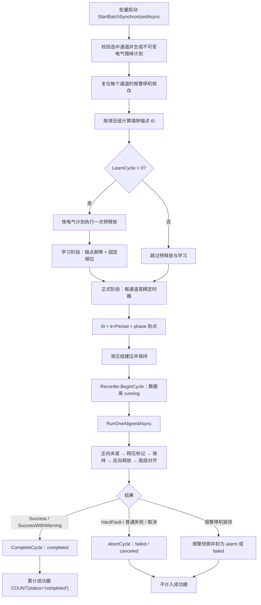
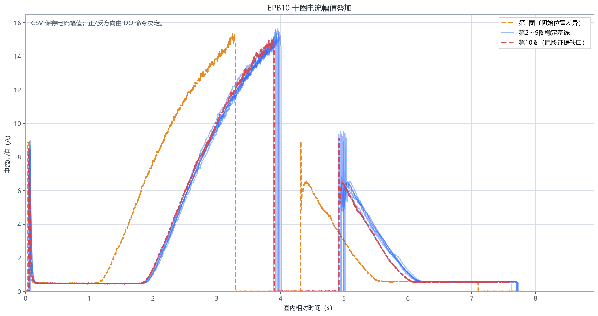
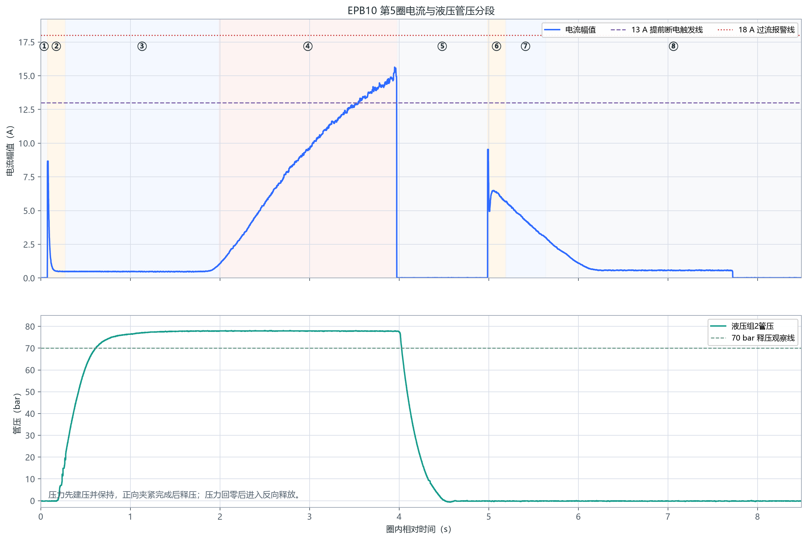
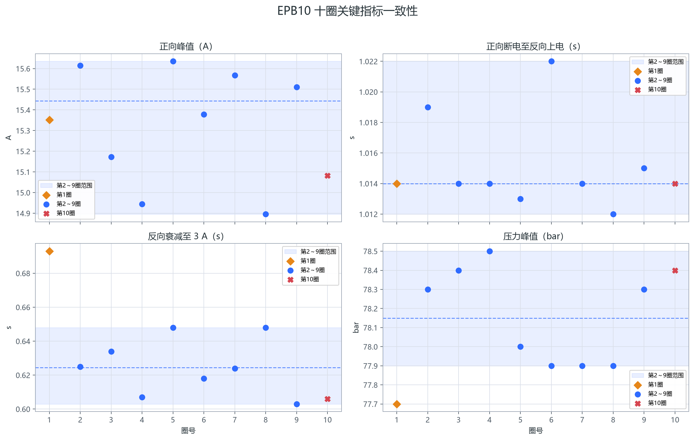

# EPB 完整控制逻辑与 EPB10 标准曲线实测说明

> 文档日期：2026-07-29
> 适用对象：EPB 疲劳试验软件开发、调试与测试人员
> 当前控制基线：`LegacyFixedTiming + AdaptiveShadowMode`
> 数据对象：EPB10，2026-07-29 09:55:57 前后的 10 个正式循环
> 文档性质：当前实现、配置、数据证据与已知缺口的统一说明；不表示本文已修改业务控制代码

## 1. 技术结论

当前程序判定“一圈完成”的核心口径是：正向夹紧判据成功、正向断电、保持完成、反向阶段执行结束、反向断电、外壳尾段结束，并且没有进入报警停机、硬故障、取消或异常分支。满足该执行路径后，圈结果为 `Success` 或 `SuccessWithWarning`，数据库写为 `completed`，累计成功圈数也只统计 `completed`。

这个口径是“程序流程完成”，不是对整条波形进行形状验收。若用于判断“标准、正常、数据证据闭环的单圈”，还必须补充检查：正向涌流与空行程是否合理、负载是否连续爬升至夹紧区、反向涌流是否在限时内衰减、反向空行程是否稳定、末端是否存在断电回零样本，以及压力是否按预期建压、保持、释压和回零。

EPB10 十圈数据证明：

- 十圈数据库均为 `completed`，CSV/BIN 圈号、样本序号和记录数一致。
- 圈起点间隔中位数为 `10.000272 s`，说明正式循环按墙钟锚点对齐，不是上一圈结束后再顺延 10 秒。
- 第 2～9 圈可作为稳定比较基线：正向峰值 `14.896～15.635 A`，正向断电至反向上电 `1.012～1.022 s`，反向衰减至 `3 A` 用时 `0.603～0.648 s`，反向空行程约 `0.567～0.580 A`，压力峰值 `77.9～78.5 bar`。
- 第 1 圈负载爬升约在 `1.261 s` 开始，明显早于第 2～9 圈的 `1.954～2.004 s`，应解释为试验开始时机械位置不同，不纳入稳定阶段统计。
- 第 10 圈数据库为 `completed`，但 CSV 在反向空行程约 `0.57 A` 时结束，没有保存反向断电后的回零样本。因此其结论是：**控制流程完成，数据证据未闭环**；不能据此反推卡钳物理动作失败，但必须从尾段完整性统计中剔除。

## 2. 适用范围、证据来源与术语

### 2.1 本文回答的问题

本文统一回答以下问题：

1. EPB 从批量启动到一圈结束，软件实际执行了哪些步骤？
2. 标准曲线的 ①～⑧ 分别对应什么物理状态、代码入口和配置？
3. 为什么上电时有涌流、随后约 `0.5 A` 空行程、最后才出现夹紧或释放负载？
4. 液压组和共享程控电源的错峰组如何与单圈配合？
5. 当前程序认定的“完成圈”与测试要求的“严格正常波形”有什么差别？
6. EPB10 十圈标准数据能证明什么，尚不能证明什么？

### 2.2 证据来源

| 类型 | 来源 | 用途 |
|---|---|---|
| 曲线原始设计说明 | [epb的控制_2026_07_29.md](01_Inboxes/epb的控制_2026_07_29.md) | ①～⑧曲线定义、共享电源错峰设计意图、异常限流平台示意 |
| 现有判定说明 | [EPB正常完整单圈判定说明-20260729.md](EPB正常完整单圈判定说明-20260729.md) | 当前单圈完成口径与已知缺口 |
| 当前运行模式 | [MTTfTest/App.config](../MTTfTest/App.config#L83) | `LegacyFixedTiming`、自适应影子模式 |
| 当前试验参数 | [MTTfTest/Config/TestConfig.xml](../MTTfTest/Config/TestConfig.xml#L11) | 周期、学习圈、EPB10、液压组、电气组参数 |
| 当前控制实现 | [EpbCycleRunner.cs](../Controller/EpbCycleRunner.cs#L672) | 正向、保持、反向、结果判定 |
| 批量与周期调度 | [EpbManager.BatchStart.cs](../Controller/EpbManager.BatchStart.cs#L62) | 预释放、学习、墙钟锚点、错峰、封圈 |
| 液压协同 | [HydraulicGroupCoordinator.cs](../Controller/HydraulicGroupCoordinator.cs#L84) | 建压保持与同组统一释压 |
| 落盘与累计计数 | [EpbDiskWriter.cs](../DataOperation/EpbDiskWriter.cs#L1210) | `running/completed/alarm/failed/canceled` 与成功圈计数 |
| EPB10 原始数据 | `D:\EPB_Data\标准的单圈epb曲线\EPB10\20260729_095557` | 十圈 CSV/BIN 电流与管压 |
| 数据库索引 | `D:\EPB_Data\EPB_Fatigue_Debug\index.db` | 圈状态、起止时间、样本数 |
| 可复跑分析 | [analyze_epb_standard_cycles.py](../Tools/analyze_epb_standard_cycles.py) | 数据校验、指标提取、图表生成 |
| 全量指标 | [EPB10_10圈关键指标.csv](assets/epb-control-20260729/EPB10_10圈关键指标.csv) | 十圈逐圈审计明细 |

### 2.3 方向、电流和时间的口径

- 原始设计图为了表达电机方向，把正向画为正电流、反向画为负电流。
- 当前采集 CSV 的 `EpbCurrent` 保存的是电流幅值，反向段仍为正数。软件控制方向应由 `CommandForward()`、`CommandReverse()` 对应的 DO 命令判断；反向判断代码也会对电流取绝对值。
- 本文中的“13 A 触发线”不是 15 A 目标本身，而是当前 `15 A - 2 A` 安全余量得到的提前断电条件。
- CSV 的 `Timestamp` 为毫秒级墙钟时间，十圈存在少量最多约 `20 ms` 的回退；`RelativeTimeSeconds` 和 `SampleIndex` 单调。所有圈内阶段分析统一使用后两者。
- 数据库的 `start_time/end_time` 用于判断圈起点间隔和正式记录区间，不用于替代高频相对时间。

## 3. 从批量启动到累计计数的完整生命周期

当前正式流程不是简单的“正转—反转”调用，而是批量计划、液压协调、电气错峰、单圈控制、报警停机与数据封圈共同组成的生命周期。



### 3.1 批量启动和报警锁存复位

批量入口会对通道去重并排序，随后为本批次生成不可变的电气错峰计划；同一批次运行期间不再依据可变配置重新计算相位。新批次还会复位上一次运行遗留的报警停止锁存，避免后续正常圈被持续标成报警圈。代码见 [EpbManager.BatchStart.cs 第 62～123 行](../Controller/EpbManager.BatchStart.cs#L62)。

### 3.2 预释放和学习阶段

当 `LearnCycle > 0` 时，程序在学习前按同一电气错峰计划执行一次预释放。EPB10 当前 `PreReleaseKeepMs=500`，即先反向释放，进入或接近反向空行程后保持约 `500 ms`。这一步用于把初始位置拉向可比较状态，但第 1 个正式圈仍可能保留机械初始位置差异。

随后进入学习阶段。学习用于采集正向/反向空行程、涌流和负载阶段的特征，并为后续判断提供基线。当前正式控制模式仍是 `LegacyFixedTiming`；`AdaptiveShadowMode=true` 表示自适应状态机主要并行观察和告警，不应把它描述成已经接管正式闭环。

### 3.3 正式周期按墙钟锚点对齐

正式阶段为每个通道创建 `AlignToWallClock` 高精度定时器，目标起点为：

```text
planned_start = t0 + k × Period + phase
```

其中 `Period=10,000 ms`，`phase` 由电气组内本次选中顺序决定。即使某一圈实际控制耗时略长或略短，下一圈仍回到墙钟锚点，不把上一圈误差累积到后续循环。实现见 [EpbManager.BatchStart.cs 第 215～316 行](../Controller/EpbManager.BatchStart.cs#L215)。

### 3.4 圈开始、封圈和累计计数

定时器到点后，程序先发起本压力组的建压协调，再调用 `Recorder.BeginCycle`。数据库先写 `running`，单圈结束后根据 `LastCycleOutcome` 和报警锁存改写：

| 执行结果 | 数据库状态 | 是否累计成功圈 |
|---|---:|---:|
| `Success` | `completed` | 是 |
| `SuccessWithWarning` | `completed` | 是 |
| `HardFault` | `failed` | 否 |
| 普通失败 | `failed` | 否 |
| 取消 | `canceled` | 否 |
| 报警停机并成功保存报警证据 | `alarm` | 否 |

封圈分支见 [EpbManager.BatchStart.cs 第 327～357 行](../Controller/EpbManager.BatchStart.cs#L327)，数据库状态写入见 [EpbDiskWriter.cs 第 1430～1507 行](../DataOperation/EpbDiskWriter.cs#L1430)。累计成功圈采用 `COUNT(status='completed')`，见 [EpbDiskWriter.cs 第 1210～1253 行](../DataOperation/EpbDiskWriter.cs#L1210)。

## 4. ①～⑧曲线阶段：物理原理、代码与配置

### 4.1 为什么刚上电会出现峰值

EPB 电机刚上电时，转子尚未建立反电动势，电枢等效阻抗较低，同时还要克服齿轮、丝杠、密封和制动机构的静摩擦，因此会出现一个持续时间很短的启动涌流。随着转速上升，反电动势增大，电流迅速回落。这个峰值不是“已经夹紧”的充分证据，所以当前代码在正向和反向上电后都先忽略 `PeakIgnoreMs=100 ms`。

### 4.2 为什么随后维持约 0.5 A

启动完成后、摩擦片尚未显著压紧制动盘之前，电机主要克服传动机构的摩擦并移动空隙，这一段负载较小且相对稳定，形成约 `0.5 A` 的空行程平台。该电流不是固定物理常数，会随卡钳、温度、润滑、供电和机械位置变化。EPB10 稳定圈中，正向空行程约 `0.47～0.48 A`，反向空行程约 `0.567～0.580 A`。

### 4.3 为什么夹紧阶段电流持续爬升

当摩擦片接触制动盘后，丝杠继续推进需要逐步提高夹紧力，电机转矩和电流随负载上升。程序不等待采样峰值真正达到 15 A 才断电，而是在 `I + SafetyMarginA >= ForwardA` 时触发高优先级断电。EPB10 当前为 `I + 2 >= 15`，即约 `13 A` 触发；由于采集、软件判断、继电器/驱动和机械惯性存在延迟，断电后的实测峰值仍会继续上升到接近 15 A。

### 4.4 八个阶段的统一对应

| 阶段 | 物理与曲线含义 | 当前代码行为 | EPB10 实测/参数 |
|---|---|---|---|
| ① | 正向供电前的未上电等待 | 正式阶段内部通常跳过，由墙钟锚点和电气相位承担 | EPB10 独立运行时相位为 0；多卡钳时由 `0/800/1600 ms` 相位形成 |
| ② | 正向刚上电的启动涌流 | `CommandForward()` 后忽略前 `100 ms`，避免误判为夹紧负载 | 第 5 圈涌流约 `8.7 A`，很快回落 |
| ③ | 正向空行程，约 `0.5 A` | 当前正式代码不单独等待空行程带宽，而是涌流忽略后直接进入夹紧阈值/平台等待 | 稳定圈约 `0.47～0.48 A` |
| ④ | 接触后负载爬升，达到夹紧区后断电 | `I+2>=15` 或限流平台兜底即高优先级断电；5 秒未达到则硬故障并报警 | 13 A 触发，实测峰值约 `14.9～15.6 A`；18 A 为过流报警线 |
| ⑤ | 正向断电到反向上电的保持 | 先向液压协调器标记“电压释放点”，再等待 `HoldMs=1000` | 稳定圈 `1.012～1.022 s` |
| ⑥ | 反向刚上电的启动涌流 | `CommandReverse()` 后忽略前 `100 ms` | 第 5 圈涌流约 `9.5 A` |
| ⑦ | 反向释放负载衰减，随后进入反向空行程 | 最多等待 `1000 ms` 观察 `|I|<=3 A`，然后固定反向空行程 `2000 ms`，最后断电 | 稳定圈衰减到 3 A 用时 `0.603～0.648 s`，空行程约 `0.57 A` |
| ⑧ | 完成后的未上电尾段 | 内部只计算剩余量；对齐外壳按相位、迟到量和硬截止补齐尾段 | 用于对齐下一圈墙钟锚点；第 10 圈缺少这一段的 CSV 证据 |

代码阶段注释和正式流程见 [EpbCycleRunner.cs 第 650～672 行](../Controller/EpbCycleRunner.cs#L650) 与 [第 703～1054 行](../Controller/EpbCycleRunner.cs#L703)。尾段对齐见 [EpbCycleRunner.Advance.Sync.cs 第 769～815 行](../Controller/EpbCycleRunner.Advance.Sync.cs#L769)。

## 5. 当前正向夹紧、过流与异常平台判据

### 5.1 主判据：13 A 提前断电

正向上电并忽略 `100 ms` 涌流后，事件驱动等待器直接接收快速采样。主判据为：

```text
abs(current) + SafetyMarginA >= ForwardA
```

EPB10 当前为：

```text
abs(current) + 2 A >= 15 A
```

即采样达到约 `13 A` 时，等待器返回成功，控制线程立即执行高优先级断电。实现见 [EpbCycleRunner.cs 第 341～350 行](../Controller/EpbCycleRunner.cs#L341) 和 [第 1407～1472 行](../Controller/EpbCycleRunner.cs#L1407)。

### 5.2 5 秒正向上限

正向等待最多 `FwdOnLimitMs=5000 ms`。超时仍未达到阈值或平台时：

1. 执行高优先级断电；
2. 触发 `ClampTimeout` 报警；
3. 结束峰值捕获；
4. 通知液压协调器释放；
5. 把本圈结果设为 `HardFault`；
6. 返回失败，不写 `completed`。

对应代码见 [EpbCycleRunner.cs 第 729～763 行](../Controller/EpbCycleRunner.cs#L729)。

### 5.3 限流平台兜底

除 13 A 主判据外，当前代码还接受“疑似限流平台”：

```text
150 ms 窗口内 max(I)-min(I) <= 0.15 A
且 I >= 已学习正向空行程电流 + 0.8 A
```

这一兜底的原意是：程控电源限流或多卡钳电流竞争时，电流可能在低于目标值处形成平坦平台，避免机械持续顶压直至 5 秒超时。但它也意味着偏低平台可能被当作“正向完成”，不能作为严格正常波形的充分条件。实现见 [EpbCycleRunner.cs 第 353～373 行](../Controller/EpbCycleRunner.cs#L353)。

### 5.4 18 A 峰值过流报警

正向断电后的峰值捕获会延迟约 1 秒封口，用于覆盖采集管线尾部。若：

```text
peak_current - ForwardA >= OvershootAlarmDeltaA
```

则触发过流报警。EPB10 为 `15 A + 3 A = 18 A`。对应代码见 [EpbCycleRunner.cs 第 910～928 行](../Controller/EpbCycleRunner.cs#L910)，报警增量配置见 [AlarmConfig.xml 第 95 行](../MTTfTest/Config/AlarmConfig.xml#L95)。

## 6. 当前反向释放逻辑

当前反向阶段不是根据负向峰值决定断电，而是：

1. 执行 `CommandReverse()`；
2. 忽略 `100 ms` 启动涌流；
3. 最多等待 `1000 ms`，观察电流幅值是否衰减至 `3 A`；
4. 不论是否在 1 秒内衰减达标，都继续固定运行反向空行程 `2000 ms`；
5. 执行反向断电；
6. 完成影子状态机观察，并进入尾段。

代码使用 `Math.Abs(current)`，所以 CSV 中反向段为正幅值不影响当前判断；方向由 DO 命令决定。实现见 [EpbCycleRunner.cs 第 941～1016 行](../Controller/EpbCycleRunner.cs#L941)。

这里存在一个必须明确的现状：**反向衰减超时只记录日志，不会把本圈改为失败。** 因此，“程序完成圈”可能包含反向衰减没有在 1 秒内达到 3 A 的圈；严格正常波形应将这种情况判为不合格或至少待复核。

## 7. EPB10 当前配置基线

EPB10 与当前 12 个通道采用相同的单圈参数。关键参数汇总如下：

| 参数 | 当前值 | 控制含义 |
|---|---:|---|
| `TestCycle` | `10 s` | 正式圈墙钟周期 |
| `LearnCycle` | `10` | 正式测试前学习圈数 |
| `ForwardA` | `15 A` | 目标夹紧电流 |
| `SafetyMarginA` | `2 A` | 提前断电余量，对应 13 A 触发 |
| `FwdOnLimitMs` | `5000 ms` | 正向上电最大等待 |
| `HoldMs` | `1000 ms` | 正向断电到反向上电保持 |
| `RevDecayLimitA` | `3 A` | 反向负载衰减观察线 |
| `RevDecayRigidMaxMs` | `1000 ms` | 反向衰减最大观察时间 |
| `RevEmptyFixedMs` | `2000 ms` | 反向固定空行程时间 |
| `PreReleaseKeepMs` | `500 ms` | 学习前预释放保持 |
| `PeakIgnoreMs` | `100 ms` | 正反向启动涌流忽略时间 |
| `OvershootAlarmDeltaA` | `3 A` | 正向峰值超过目标 3 A 报警，即 18 A |
| 电气组 `StaggerMs` | `800 ms` | 同电源卡钳固定错峰 |

EPB10 的参数配置见 [TestConfig.xml 第 303～315 行](../MTTfTest/Config/TestConfig.xml#L303)，电气组配置见 [第 346～368 行](../MTTfTest/Config/TestConfig.xml#L346)。

## 8. 液压协同：压力组 2 建压、保持和释压

### 8.1 EPB10 的液压归属

当前液压组配置为：

- 液压组 1：EPB1～EPB6；
- 液压组 2：EPB7～EPB12。

所以 EPB10 属于液压组 2。正式圈到达锚点时，液压协调器把本轮参与的同组通道登记到 `InFlight`，若该组尚未建压，则启动 `BuildAndHoldAsync`。建压任务不会阻塞 EPB 电控流程，而是保持至统一释放。代码见 [HydraulicGroupCoordinator.cs 第 84～128 行](../Controller/HydraulicGroupCoordinator.cs#L84)。

### 8.2 何时释压

每个同液压组通道正向达到夹紧判据并断电后，会调用 `HydraulicMarkReleaseAsync`。协调器从 `InFlight` 中移除该通道；只有本轮同组所有参与通道都到达电压释放点，才统一执行液压释放。实现见 [HydraulicGroupCoordinator.cs 第 198～223 行](../Controller/HydraulicGroupCoordinator.cs#L198)。

EPB10 单通道实测的时序为：

1. 圈开始后约 `0.2 s` 开始建压；
2. 压力稳定在约 `78 bar`；
3. 正向夹紧完成并断电后立即开始释压；
4. 压力回零后再进入反向阶段。

这说明液压主要支撑正向夹紧阶段，反向释放在管压基本回零后执行。

### 8.3 `PressureThresholdBar` 的语义风险

当前配置同时存在：

```xml
<SetPercent>100</SetPercent>
<PressureThresholdBar>100</PressureThresholdBar>
```

但 `BuildAndHoldAsync` 直接把 `PressureThresholdBar` 传给 `_ao.WritePressure(...)`，同时日志又把它格式化为百分比，见 [HydraulicController.cs 第 80～108 行](../Controller/HydraulicController.cs#L80)。这造成同一字段兼具“压力阈值 bar”和“AO 输出百分比”两种语义：

- 如果 `WritePressure` 参数语义是百分比，则字段名误导；
- 如果参数语义是 bar，则 `SetPercent` 没有在此路径生效；
- 实测峰值约 `78 bar`，不能仅凭配置中的 `100` 判断目标到底是 `100%` 还是 `100 bar`。

本文只记录风险，不修改液压逻辑。后续应拆分并明确 `AoSetPercent` 与 `PressureReachedBar`，并为两者分别做范围校验和日志输出。

## 9. 多卡钳共享电源：电气组错峰与压力组相互独立

### 9.1 EPB10 的电气归属

当前电气组为：

- 组 1：EPB1、EPB2、EPB3；
- 组 2：EPB4、EPB5、EPB6；
- 组 3：EPB7、EPB8、EPB9；
- 组 4：EPB10、EPB11、EPB12。

因此 EPB10、EPB11、EPB12 共用一组电气错峰配置。批量开始时，程序取“本次选中通道 ∩ XML 组成员”，按通道号升序重新编号，并计算：

```text
phase = selected_index_in_group × 800 ms
```

当 EPB10/11/12 都被选中时，固定相位分别为 `0/800/1600 ms`。若只选择 EPB10 和 EPB12，则它们会按本次选中顺序使用 `0/800 ms`，不会为未选中的 EPB11保留空相位。实现见 [ElectricalStaggerPlan.cs 第 100～208 行](../Controller/ElectricalStaggerPlan.cs#L100)。

### 9.2 为什么必须错峰

同一程控电源上的多只卡钳若同时进入正向负载爬升或启动涌流，会叠加电流需求，可能触发电源限流，出现原始设计文档所示的高电流平台或电压下跌。错开 `800 ms` 不能保证任意长负载段绝不重叠，但能显著减少涌流同时出现和负载爬升完全重合的概率。

### 9.3 两种分组不能混为一谈

EPB10 同时属于：

- 液压组 2：EPB7～EPB12；
- 电气组 4：EPB10～EPB12。

液压组解决“哪些卡钳共享建压/释压动作”，电气组解决“哪些卡钳共享电源、需要固定相位”。它们是两个独立维度。不能因为 EPB10 与 EPB7 同属液压组，就把二者强制按同一电气相位处理；也不能因为 EPB10 与 EPB11 共用电源，就在 EPB10 正向断电时无条件释放整个液压组。

## 10. EPB10 十圈实测证据

### 10.1 十圈总体形状稳定，但第 1 圈位置不同、第 10 圈缺尾段

下图把十圈电流幅值按圈内相对时间叠加。第 2～9 圈的正向负载爬升、断电、反向衰减和空行程高度重合，可作为稳定基线。第 1 圈用橙色表示，负载爬升和正向断电均明显提前；第 10 圈用红色表示，其控制主体与稳定圈一致，但记录在反向空行程中结束。



该图不能用曲线正负判断方向，因为 CSV 存的是幅值。第 1 圈的差异主要是初始机械位置，不能直接判为异常；第 10 圈的红线缺少断电回零段，必须判为“证据未闭环”。

### 10.2 第 5 圈展示了电流与管压的完整协同

第 5 圈是稳定基线中的代表圈。上、下两面板共用相同时间轴，避免双 Y 轴造成误读。电流面板标出了 ①～⑧、13 A 提前断电线和 18 A 报警线；压力面板显示液压先建压并保持，正向断电后开始释压，压力回零后才进入反向。



第 5 圈关键时间为：正向负载爬升约 `1.989 s` 开始，约 `3.543 s` 越过 13 A，正向峰值 `15.635 A`，约 `3.974 s` 断电；反向约 `4.987 s` 上电，约 `0.648 s` 后衰减到 3 A，随后进入约 `0.573 A` 的反向空行程。

### 10.3 第 2～9 圈是稳定比较基线

下图按圈号比较正向峰值、保持时间、反向衰减时间和压力峰值。蓝色阴影是第 2～9 圈范围，虚线是其中位数；第 1 圈和第 10 圈单独着色，避免把初始位置和尾段缺失混入稳定统计。



| 指标 | 第 2～9 圈范围 | 解释 |
|---|---:|---|
| 正向峰值 | `14.896～15.635 A` | 13 A 触发后存在采集、断电和机械惯性形成的继续爬升 |
| 正向断电至反向上电 | `1.012～1.022 s` | 与 `HoldMs=1000 ms` 一致，额外十余毫秒来自调度和采样边界 |
| 反向衰减到 3 A | `0.603～0.648 s` | 全部在 `1000 ms` 上限内 |
| 反向空行程 | `0.567～0.580 A` | 稳定且略高于正向空行程 |
| 压力峰值 | `77.9～78.5 bar` | 液压组 2 本次实测平台 |
| 负载爬升起点 | `1.954～2.004 s` | 第 1 圈为 `1.261 s`，故单独解释 |

### 10.4 周期对齐证据

数据库相邻圈 `start_time` 间隔：

- 中位数：`10.000272 s`；
- 最小值：约 `9.990 s`；
- 最大值：约 `10.011 s`。

第 2～9 圈每圈 CSV 的正式记录区间约 `8.36～8.49 s`，到下一圈起点前仍有约 `1.52～1.62 s` 的未上电间隔。这个间隔是墙钟周期剩余部分，不代表程序把下一圈推迟到“上一圈结束 + 10 s”。

### 10.5 第 10 圈为什么只能判“控制完成、证据未闭环”

第 10 圈满足：

- 数据库 `status=completed`；
- CSV/BIN 样本数均为 `15180`；
- 正向峰值、保持、反向衰减和压力峰值均落在正常范围；
- CSV 最后一个样本电流仍约 `0.570 A`；
- 记录中没有反向断电后的连续近零尾段。

因此：

```text
程序状态：完成
主体波形：正常
尾段数据：不完整
最终结论：控制完成、数据证据未闭环
```

合理的技术解释是最后一圈停止、封圈、采集缓冲刷新或文件导出时序没有把断电后的尾部样本包含进本圈 CSV；现有证据不能唯一确定是哪一个环节，也不能据此声称物理卡钳未断电。后续应以 DO 断电追踪、DAQ 最后回调时间和落盘队列排空日志联合定位。

## 11. “程序完成圈”与“严格正常波形”的双口径

### 11.1 程序完成圈

按当前代码，只要满足以下路径即可写为 `completed`：

1. 正向达到 13 A 提前断电判据，或被限流平台兜底接受；
2. 未发生 5 秒正向超时硬故障；
3. 正向断电并完成液压释放标记；
4. 保持时间执行完成；
5. 反向衰减观察结束；
6. 固定反向空行程执行完成并断电；
7. 未取消、未抛出未处理异常、未触发报警停机；
8. 结果为 `Success` 或 `SuccessWithWarning`。

### 11.2 严格正常波形

建议开发和测试采用以下更严格的验收口径。它不会改变当前数据库状态，只用于波形质量判定：

| 检查项 | 建议判定 |
|---|---|
| 数据结构 | CSV/BIN 成对；圈号一致；样本序号连续；无空值；相对时间单调；BIN 记录数等于 CSV 行数 |
| 正向启动 | 存在短时涌流，且不能直接把涌流作为夹紧完成 |
| 正向空行程 | 涌流后回到合理、稳定的小电流平台；需结合学习值和设备基线 |
| 正向负载 | 电流从空行程连续爬升；应到达主判据或经过明确审批的限流降级判据 |
| 正向安全 | 5 秒内完成；峰值未达到 18 A 报警线；无异常长平台和电流竞争证据 |
| 液压 | 建压成功并稳定；正向夹紧完成后释压；反向前基本回零 |
| 保持 | 约 1 秒，允许小量调度偏差 |
| 反向衰减 | 应在 1 秒内衰减到 3 A；超时不得仍按“严格正常”通过 |
| 反向空行程 | 约 2 秒控制时间，电流落在学习/稳定基线允许范围 |
| 尾段闭环 | 反向断电后至少保存一段连续近零样本，且 DO 断电时间、DAQ 和文件末尾可追溯 |
| 状态一致 | 波形质量、报警记录、`LastCycleOutcome`、数据库状态和累计圈数一致 |

### 11.3 建议的最终分类

| 分类 | 含义 | 是否计成功圈 |
|---|---|---:|
| `NormalComplete` | 程序完成且严格波形全部通过 | 是 |
| `CompleteWithWarning` | 程序完成，存在非致命质量警告，但证据仍闭环 | 由试验规范决定 |
| `ControlCompleteEvidenceOpen` | 程序完成，但尾段或关键证据缺失；EPB10 第 10 圈属于此类 | 不应计入严格正常波形统计 |
| `AbnormalWaveform` | 程序可能完成，但反向超时、偏低平台、压力异常等不满足严格波形 | 否 |
| `Alarm/Failed/Canceled` | 控制未正常完成 | 否 |

## 12. 当前代码与严格正常波形之间的差距

### 12.1 反向衰减超时仍可能成功

`RevDecayRigidMaxMs=1000` 到时后，代码仅记录“未达标”，随后仍执行 2 秒反向空行程并返回成功。该行为适合“确保释放动作继续完成”的容错目的，但状态层必须把它至少提升为 `SuccessWithWarning`，严格波形应直接判异常。

### 12.2 限流平台兜底可能接受偏低平台

平台兜底只要求电流比学习空行程高 `0.8 A` 且 150 ms 内足够平坦，不要求接近 13 A 或 15 A。电源限流、电流竞争或机械卡滞都可能形成平台。建议记录 `clamp_completion_reason=Threshold|PlateauFallback`，并为平台兜底增加最小绝对电流、平台持续上限、电压状态和共享电源总电流等二次校验。

### 12.3 影子硬故障不会停止传统模式

在 `LegacyFixedTiming` 下，自适应状态机产生 `HardFault` 时，代码明确转换成“影子硬故障，不执行停机”的警告，见 [EpbCycleRunner.Adaptive.cs 第 199～205 行](../Controller/EpbCycleRunner.Adaptive.cs#L199)。这符合影子模式不干预控制的原则，但测试报告不能把影子硬故障当作已被正式保护逻辑拦截。

### 12.4 警告圈仍写为 `completed`

`SuccessWithWarning.IsSuccess=true`，批量封圈分支会调用 `CompleteCycle`。因此当前数据库无法只靠 `status=completed` 区分无警告圈与警告圈。建议在 `epb_cycles` 增加 `outcome_kind`、`completion_reason`、`warning_flags` 和关键阶段指标字段，或建立独立的圈质量表。

### 12.5 最后一圈停止与落盘时序可能缺尾段

EPB10 第 10 圈已经证明：数据库 `completed` 不保证 CSV 包含断电回零证据。建议把“控制结束”与“数据证据封圈”拆开：

1. 先执行并记录 DO 断电；
2. 等待不少于配置值的断电后采样窗口；
3. 等待 DAQ 批次到达并刷新落盘队列；
4. 校验末尾连续近零样本；
5. 最后才把数据库状态从 `running` 改为 `completed`。

### 12.6 时间戳回退

十圈墙钟时间戳存在少量回退，第 1 圈 125 次、第 2 圈 86 次，其余大多为 0～7 次，最大约 20 ms。这更像批次到达、时间格式化或缓冲排序问题，而不是采样丢失，因为 `SampleIndex` 连续且 `RelativeTimeSeconds` 单调。算法和报告必须禁止用墙钟时间排序圈内样本。

## 13. 开发与测试排查矩阵

| 现象 | 当前程序可能结果 | 优先检查 | 严格波形结论 |
|---|---|---|---|
| 正向 5 秒仍未达到判据 | `HardFault`、报警、failed/alarm | 电源限流、线束、DO 方向、卡钳堵转、采集链路 | 不合格 |
| 正向在较低电流形成平坦平台 | 可能被平台兜底判成功 | 平台绝对值、电源电压、同组总电流、学习空行程值 | 待复核/通常不合格 |
| 正向峰值 ≥18 A | 过流报警 | 断电延迟、继电器/驱动、SafetyMargin、机械惯性 | 不合格 |
| 反向 1 秒内未降到 3 A | 当前仍可能 completed | 反向方向、卡滞、释放负载、电流采样 | 不合格 |
| 反向空行程明显偏离约 0.57 A | 当前可能 completed | 机械阻力、温度、供电、初始位置、学习值 | 待复核 |
| 压力未建起或异常波动 | 电控可能继续 | 液压 DO/AO、压力传感器、组映射、字段语义 | 不合格 |
| 压力未回零就反向 | 当前缺少显式强制门槛 | 同组 `InFlight`、释放回调、液压响应 | 不合格 |
| DB completed 但 CSV 末尾仍约 0.5 A | EPB10 第 10 圈现象 | 停止时序、DAQ flush、落盘队列、末尾窗口 | 证据未闭环 |
| 同电源三卡钳同时出现峰值 | 可能限流/平台 | 电气组映射、选中顺序、800 ms 相位日志 | 不合格 |
| 第 1 圈空行程明显更短 | 不一定异常 | 试验开始机械位置、预释放结果 | 单独记录，不混入稳定基线 |

## 14. 数据分析方法与复跑

### 14.1 结构校验

[analyze_epb_standard_cycles.py](../Tools/analyze_epb_standard_cycles.py) 会执行：

- 发现 EPB 指定通道的 CSV/BIN 对；
- 校验文件圈号、CSV `Cycle`、连续 `SampleIndex`、空值和相对时间单调性；
- 按 `32 byte/record` 校验 BIN 记录数；
- 在提供 `index.db` 时校验圈记录、样本数和数据库状态；
- 记录墙钟时间戳回退次数和最大回退；
- 结构错误返回非零退出码；
- 波形异常或尾段缺失写入 `quality_flags`，仍生成指标和图表。

### 14.2 阶段提取规则

分析脚本是离线审计工具，不等同于控制代码。关键规则为：

- `I > 0.1 A` 识别上电段；
- 相邻上电样本时间差大于 `0.2 s` 时切分正向和反向段；
- 13 A 和 3 A 使用现行配置阈值；
- 负载爬升起点采用持续性阈值启发式，避免单点噪声；
- 反向断电后至少 `0.2 s` 连续近零记录，才认定尾段证据完整；
- 第 2～9 圈作为稳定基线，第 1 圈和第 10 圈分别处理。

这些阈值用于复现本报告，不应未经验证直接替代在线控制状态机。

### 14.3 复跑命令

在仓库根目录执行：

```powershell
python Tools\analyze_epb_standard_cycles.py `
  --input-dir "D:\EPB_Data\标准的单圈epb曲线\EPB10\20260729_095557" `
  --index-db "D:\EPB_Data\EPB_Fatigue_Debug\index.db" `
  --epb-id 10 `
  --output-dir "docs\assets\epb-control-20260729"
```

脚本参数不写死本机数据路径，可替换为其他通道、批次和输出目录。当前附件使用 Microsoft YaHei 字体和 Matplotlib 静态图生成。

## 15. 建议的后续整改顺序

本文未修改业务控制代码。若要把严格波形标准真正落到程序，建议按以下优先级实施：

1. **补齐圈质量字段。** 明确记录主阈值、平台兜底、反向衰减超时、影子警告和尾段证据状态，不再只依赖 `completed`。
2. **修复最后一圈证据封口。** DO 断电、DAQ 尾部采样、落盘队列清空和数据库完成状态形成原子化或可审计顺序。
3. **把反向衰减超时升级为显式结果。** 可以继续执行释放以保证安全，但最终结果不得无警告地成功。
4. **收紧限流平台兜底。** 加入绝对电流下限、电源电压/限流状态、同组总电流和持续时间判据。
5. **拆分液压 AO 与压力阈值语义。** 分离百分比输出和 bar 阈值，并增加单位明确的配置、日志和测试。
6. **建立在线严格波形检查。** 以学习基线和设备容差检查涌流、空行程、负载爬升、压力、反向释放和断电尾段。
7. **固化回归数据集。** 把 EPB10 第 2～9 圈作为正常基线，第 1 圈作为初始位置变体，第 10 圈作为证据缺口用例，另补正向平台、反向超时、压力异常和过流报警用例。

## 16. 尚需进一步确认的问题

1. `_ao.WritePressure` 的参数单位究竟是输出百分比、工程量 bar，还是经内部换算后的统一设定值？
2. 第 10 圈缺尾段发生在 `StopChannel`、DAQ 回调、CSV/BIN 导出还是 writer 队列封口的哪一步？
3. 平台兜底是否是正式测试允许的成功路径，若允许，其最小绝对电流和适用电源状态是什么？
4. 反向衰减 1 秒超时后，业务希望“继续释放但本圈失败”，还是“继续释放并报警停机”？
5. 严格正常波形的空行程电流和阶段时长容差，应采用固定工程限值，还是按每只卡钳学习基线动态生成？
6. 多卡钳同时运行时，是否能同步记录程控电源电压、总电流和限流状态，以区分卡钳机械异常与电源竞争？

---

**统一判定建议：** `completed` 只能证明当前控制流程走到了成功封圈；只有正向、液压、反向和断电尾段的波形证据全部闭环，才应称为“正常完整单圈”。
