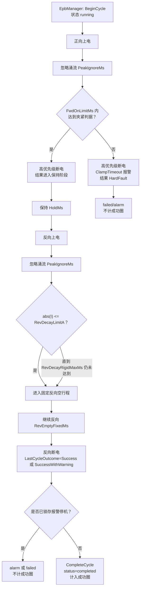

# EPB 正常完整单圈判定说明

> 适用代码：当前工作区 `EPBTest`  
> 核对日期：2026-07-29  
> 当前现场模式：`LegacyFixedTiming`，同时开启 `AdaptiveShadowMode`

## 1. 结论

当前程序不是在一段历史电流曲线中“识别出一圈”，而是由 `EpbCycleRunner` 主动执行一次正向夹紧和反向释放，并由 `EpbManager` 在动作前后调用 `BeginCycle`、`CompleteCycle` 给数据封圈。

按当前代码口径，一圈被判为“正常完成”需要同时满足：

1. 正向上电后，在 `FwdOnLimitMs` 内达到夹紧判据；
2. 正向立即断电，并完成 `HoldMs` 保持；
3. 反向上电，走完“峰值衰减等待 + 固定反向空行程”；
4. 全程没有取消、未处理异常或已锁存的报警停机；
5. `LastCycleOutcome` 为 `Success` 或 `SuccessWithWarning`；
6. Recorder 最终将该圈状态写成 `completed`。

用逻辑表达式表示：

```text
程序成功圈 =
    正向夹紧判据成功
    AND 正向/保持/反向流程执行到末尾
    AND LastCycleOutcome.IsSuccess
    AND 未锁存报警停机
    AND Recorder.status == "completed"
```

需要特别区分：

- **完整圈**：控制流程和封圈流程完整，数据库状态为 `completed`。
- **严格意义上的正常波形**：除完整外，还应验证正向爬升、峰值、反向衰减、空行程平台、断电回零等波形质量。

当前生产配置下，程序实现了前一种判定，但尚未对每个 `completed` 圈执行完整的离线波形质量验收。因此，当前代码中的“完成”不能完全等同于“波形所有特征均正常”。

## 2. 标准曲线与代码阶段对应

用户提供的标准单圈曲线可分为以下阶段。图中时间和电流为目测近似值，用于帮助理解，不作为代码阈值。

| 曲线阶段 | 图中大致表现 | 当前代码动作/判据 |
|---|---|---|
| 正向上电涌流 | `t≈0` 出现约 `9 A` 的窄峰 | `CommandForward()` 后忽略 `PeakIgnoreMs=100 ms`，不拿涌流作夹紧判断 |
| 正向空行程 | 电流回落并维持在约 `0.5 A` | 当前正式控制不单独要求识别空行程；影子状态机会观测这一平台 |
| 正向负载爬升 | `t≈1.2~3.3 s` 从约 `0.5 A` 上升到约 `15 A` | 等待夹紧判据；当前配置为 `ForwardA=15 A`、`SafetyMarginA=2 A`，所以主要触发点是 `|I| >= 13 A` |
| 正向断电 | 峰值后立即跌到 `0 A` | 夹紧判据成立后立即 `CommandOffHighPriority()` |
| 夹紧保持 | 约 `1 s` 电流为 `0 A` | `HoldMs=1000 ms` |
| 反向上电涌流 | `t≈4.3 s` 出现约 `9 A` 的窄峰 | `CommandReverse()` 后忽略 `PeakIgnoreMs=100 ms` |
| 反向负载衰减 | 电流由约 `6.5 A` 下降 | 每个采样周期检查 `abs(I) <= RevDecayLimitA`；当前为 `3 A` |
| 反向空行程 | 电流下降到约 `0.5~0.7 A` 并保持 | 衰减达到 `3 A` 后，继续反向固定运行 `RevEmptyFixedMs=2000 ms` |
| 反向断电/圈结束 | `t≈7.1 s` 降到 `0 A` | `CommandOff()`，设置成功结果；外层完成尾段对齐后封圈 |

这条标准曲线与当前参数高度一致：

- 正向目标峰值约 `15 A`，对应 `ForwardA=15 A`；
- 正向断电到反向上电间隔约 `1 s`，对应 `HoldMs=1000 ms`；
- 反向下降到 `3 A` 左右后仍继续约 `2 s`，对应 `RevDecayLimitA=3 A` 和 `RevEmptyFixedMs=2000 ms`；
- 正、反向开头的窄峰属于上电涌流，前 `100 ms` 被忽略。

## 3. 当前正式单圈的实际执行流程



### 3.1 圈的起点

批量正式试验中，外层在调用 Runner 前执行：

```csharp
Recorder?.BeginCycle(ch, cycleNumber, DateTime.UtcNow);
MarkCurrentCycleNumber(ch, cycleNumber);
```

见 [`EpbManager.BatchStart.cs`](../Controller/EpbManager.BatchStart.cs#L300-L316)。

`BeginCycle` 会把数据库状态写成 `running`，并把随后采集的电流、压力样本归到该圈。见 [`EpbDiskWriter.cs`](../DataOperation/EpbDiskWriter.cs#L350-L363) 和 [`EpbDiskWriter.cs`](../DataOperation/EpbDiskWriter.cs#L1434-L1444)。

因此，正式圈的边界不是通过查找“电流从 0 突然升高”得到的，而是由控制层明确通知数据层。

### 3.2 正向夹紧判据

正式单圈入口是 [`RunOneAsync`](../Controller/EpbCycleRunner.cs#L672-L677)。当前 `App.config` 配置为：

```xml
<add key="EpbControlMode" value="LegacyFixedTiming" />
<add key="EpbAdaptiveShadowMode" value="true" />
```

见 [`App.config`](../MTTfTest/App.config#L80-L88)。

在传统模式下，正向流程为：

1. `CommandForward()`；
2. 等待 `PeakIgnoreMs`，忽略上电涌流；
3. 调用 `WaitCurrentAboveAsync(_posThrA, token)`；
4. 成功后立即高优先级断电；
5. 失败则触发 `ClampTimeout`，本圈为 `HardFault`。

见 [`EpbCycleRunner.cs`](../Controller/EpbCycleRunner.cs#L712-L768)。

夹紧成功实际有两条“或”关系的路径。

#### 路径 A：提前断电阈值

```text
abs(当前电流) + SafetyMarginA >= ForwardA
```

等价于：

```text
abs(当前电流) >= ForwardA - SafetyMarginA
```

当前 12 路配置均为：

```text
ForwardA       = 15 A
SafetyMarginA  = 2 A
主要触发电流   = 13 A
```

判据实现见 [`EpbCycleRunner.cs`](../Controller/EpbCycleRunner.cs#L341-L351)，参数定义见 [`EpbCycleRunnerConfig.cs`](../Config/Models/EpbCycleRunnerConfig.cs#L26-L38)，当前 EPB1 配置见 [`TestConfig.xml`](../MTTfTest/Config/TestConfig.xml#L185-L197)。

这里的 `ForwardA=15 A` 是希望控制的目标峰值附近；`SafetyMarginA=2 A` 用于提前发断电命令，以补偿采集、线程调度、继电器和电机惯性带来的继续上冲。所以标准图上最终峰值接近 `15 A`，并不与 `13 A` 左右发出断电指令矛盾。

#### 路径 B：限流平台兜底

如果未达到上述阈值，但连续约 `150 ms` 满足：

```text
窗口最大值 - 窗口最小值 <= 0.15 A
AND 当前电流 >= 已学习正向空行程电流 + 0.8 A
```

程序也会把它当作夹紧判据成功。见 [`EpbCycleRunner.cs`](../Controller/EpbCycleRunner.cs#L353-L373)。

这条路径用于电源限流或负载平台场景，避免永远等不到 `ForwardA`。它也是“程序完成不一定等于波形严格正常”的一个原因：一个稳定但偏低的平台有可能提前满足兜底判据。

#### 正向超时

上述两条路径在 `FwdOnLimitMs` 内都未成立，则返回失败。当前配置：

```text
FwdOnLimitMs = 5000 ms
```

超时后立即断电、触发 `ClampTimeout`，结果为 `HardFault`，不会封为正常完成圈。见 [`EpbCycleRunner.cs`](../Controller/EpbCycleRunner.cs#L1435-L1452) 和 [`EpbCycleRunner.cs`](../Controller/EpbCycleRunner.cs#L734-L762)。

### 3.3 正向峰值过流报警

正向峰值通过 DAQ 全数据窗口异步封口。当前报警配置：

```text
ForwardA               = 15 A
OvershootAlarmDeltaA   = 3 A
报警线                 = Imax >= 18 A
```

判据是：

```text
Imax - ForwardA >= OvershootAlarmDeltaA
```

见 [`EpbCycleRunner.cs`](../Controller/EpbCycleRunner.cs#L910-L921)；默认增量配置见 [`AlarmConfig.xml`](../MTTfTest/Config/AlarmConfig.xml#L84-L98)。

标准图正向峰值约 `15 A`，未达到 `18 A` 报警线。

### 3.4 保持阶段

正向夹紧成功并断电后，等待 `HoldMs`。当前为：

```text
HoldMs = 1000 ms
```

见 [`EpbCycleRunner.cs`](../Controller/EpbCycleRunner.cs#L934-L939)。曲线上对应正向峰值后到反向涌流前约 `1 s` 的零电流段。

### 3.5 反向释放阶段

当前传统模式的反向逻辑是：

1. `CommandReverse()`；
2. 忽略 `PeakIgnoreMs=100 ms` 的反向涌流；
3. 每隔 `_sampleMs` 读取一次电流绝对值；
4. 若 `abs(I) <= RevDecayLimitA`，认为峰值衰减达到要求；
5. 最多等待 `RevDecayRigidMaxMs`；
6. 然后无条件继续反向运行 `RevEmptyFixedMs`；
7. 最后断电。

当前参数为：

```text
RevDecayLimitA       = 3 A
RevDecayRigidMaxMs   = 1000 ms
RevEmptyFixedMs      = 2000 ms
```

实现见 [`EpbCycleRunner.cs`](../Controller/EpbCycleRunner.cs#L941-L1016)。

一个重要事实是：**传统模式下，如果反向电流在 1000 ms 内没有降到 3 A，代码只写日志，仍然继续固定反向 2000 ms，最后仍可返回成功。** 当前代码没有因 `decayReached == false` 把本圈设为 `HardFault`。

所以，从现有代码口径看：

```text
反向衰减达标   -> 可完成
反向衰减未达标 -> 目前也可能完成
```

这也是当前“完整圈”和“严格正常圈”最明显的差距。

### 3.6 圈的成功结果、计数与落盘

传统流程走到反向断电后，设置：

```csharp
Kind  = Success 或 SuccessWithWarning;
Stage = Released;
```

见 [`EpbCycleRunner.cs`](../Controller/EpbCycleRunner.cs#L1037-L1054)。

`IsSuccess` 同时接受 `Success` 和 `SuccessWithWarning`。见 [`EpbAdaptiveControl.cs`](../Controller/Adaptive/EpbAdaptiveControl.cs#L46-L66)。

对齐外壳收到 `ok == true` 后才触发 `ChannelCycleCompleted`，UI 随后增加 `RunCount`。见 [`EpbCycleRunner.Advance.Sync.cs`](../Controller/EpbCycleRunner.Advance.Sync.cs#L769-L815) 和 [`FrmEpbMainMonitor.cs`](../MTTfTest/FrmEpbMainMonitor.cs#L1287-L1329)。

数据层再根据结果封圈：

- 已请求报警停机：等待报警快照后封为 `alarm`，或快照失败封为 `failed`；
- `HardFault`：封为 `failed`；
- `IsSuccess`：封为 `completed`；
- 取消：封为 `canceled`。

见 [`EpbManager.BatchStart.cs`](../Controller/EpbManager.BatchStart.cs#L327-L357)。

系统重新加载累计次数时，权威口径是：

```sql
COUNT(status = 'completed' AND cycle_number > 0)
```

`alarm`、`failed`、`canceled`、`running` 都不计入成功圈。见 [`EpbDiskWriter.cs`](../DataOperation/EpbDiskWriter.cs#L1207-L1249)。

## 4. 当前“正常完成”的判定清单

### 4.1 会判为完成圈

满足以下条件时，当前代码会把圈计为成功：

- 正向在 5 秒内达到 `abs(I) >= 13 A`；或满足限流平台兜底判据；
- 正向成功后完成 1 秒保持；
- 反向流程执行到固定空行程结束；
- 没有取消、未处理异常或锁存报警；
- 最终数据库状态为 `completed`。

影子状态机出现软预警时，传统控制仍可能以 `SuccessWithWarning` 完成并计数；出现“影子硬故障，不执行停机”时也不会仅因此强制终止传统控制，本圈仍可能完成。见 [`EpbCycleRunner.Adaptive.cs`](../Controller/EpbCycleRunner.Adaptive.cs#L170-L205)。

### 4.2 不会判为完成圈

以下情况不会计入成功圈：

- 正向在 `FwdOnLimitMs` 内既未达到提前断电阈值，也未满足平台兜底；
- 操作被取消；
- Runner 抛出未处理异常；
- 正向峰值达到过流报警线并锁存报警停机；
- 自适应控制模式下状态机判定硬故障；
- 数据层最终状态为 `alarm`、`failed`、`canceled` 或遗留 `running`。

## 5. 当前判定尚未覆盖的波形质量要求

现有 `completed` 判定没有逐圈强制验证以下项目：

1. 正向是否先有稳定的低电流空行程，再进入连续负载爬升；
2. 正向峰值是否落在一个上下限窗口内，而不只是没有超过报警线；
3. 正向爬升斜率、持续时间是否处于正常范围；
4. 反向峰值是否存在且大小合理；
5. 反向电流是否真的在 `RevDecayRigidMaxMs` 内降到 `RevDecayLimitA`；
6. 反向空行程平台是否稳定、是否接近学习基线；
7. 反向断电后是否及时回到近零；
8. 本圈样本数、有效时长是否达到合理下限；
9. 电流曲线阶段顺序是否完整，是否存在缺段、粘连或重复上电。

数据导出校验目前主要检查圈号一致、样本序号连续和时间戳有效，不检查上述波形形态。见 [`EpbDiskWriter.cs`](../DataOperation/EpbDiskWriter.cs#L837-L873)。

## 6. 建议的统一口径

为了避免现场沟通中把“动作跑完”与“产品状态正常”混为一谈，建议以后采用三级结果：

| 结果 | 建议含义 | 当前代码对应 |
|---|---|---|
| `Complete` | 控制流程完整、数据成功封圈 | `status='completed'` |
| `CompleteWithWarning` | 流程完整，但波形存在软异常，需要追踪 | 当前 `SuccessWithWarning`，但数据库仍写成 `completed` |
| `Invalid/Alarm` | 流程不完整或触发硬故障/报警 | `failed`、`canceled`、`alarm` |

若目标是让“正常完整圈”真正等同于用户提供的标准曲线，建议后续增加一个独立的 `EpbCycleWaveformValidator`，在封为 `completed` 前按本节第 5 条做逐圈验证。其中应优先补齐：

1. `decayReached == false` 时至少标记 `CompleteWithWarning`，必要时直接失败；
2. 正、反向空行程平台确认；
3. 正向峰值上下限，而不只有上限报警；
4. 阶段时长与样本完整性检查；
5. 将验证结果和原因写入圈索引，避免所有成功和带警告圈都只显示为 `completed`。

## 7. 一句话判断标准

**按当前代码，一个正常测试完整的 EPB 单圈，是“正向在限定时间内满足夹紧阈值或平台判据，断电保持后完成整段反向动作，全程未被取消或报警停机，最终由 Recorder 封为 `completed` 的一圈”；但这仍是控制流程完整性判定，不是对标准波形全部特征的严格质量判定。**
