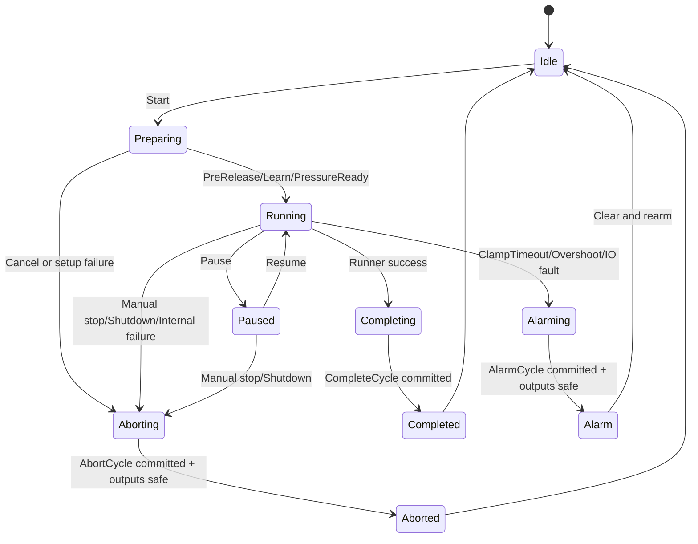
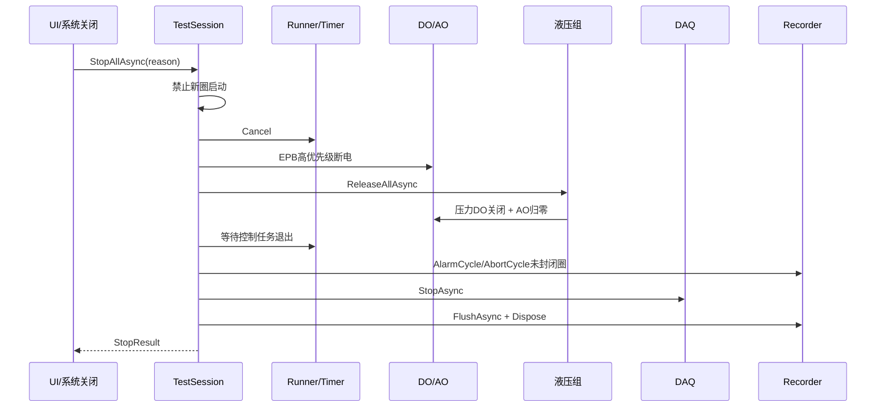
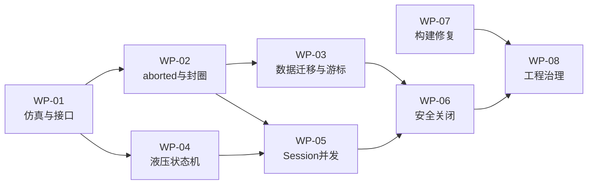

# EPBTest 安全与数据整改实施方案

> 文档类型：可执行整改规格 / 任务分派依据  
> 源码基线：`feature/safety-margin-freezeA-20260101`，提交 `e60304d`  
> 编制日期：2026-07-27  
> 优先原则：硬件安全 > 数据正确性 > 并发稳定性 > 构建与测试 > 架构清理  
> 数据约束：必须无损兼容现有 32 字节 `.dat` 记录和 `index.db`，不得自动删除、重建或覆盖历史数据

## 1. 文档目的

本文不是功能介绍，而是可直接分派给开发、测试和台架人员的整改实施规格。项目现有功能与架构请参阅[《项目全功能详解》](项目全功能详解.md)。

本文用于：

- 明确当前已确认的安全、数据和工程隐患；
- 固定目标行为、接口和数据库迁移口径；
- 将整改拆分为有依赖顺序的任务包；
- 给出自动化仿真、故障注入和真实台架验收标准；
- 防止整改过程中出现“不同开发人员采用不同口径”的二次风险；
- 为每项风险提供状态跟踪和关闭证据。

本文不直接要求第一阶段重写 WinForms UI，也不改变现有 `SampleRecord` 二进制布局。

## 2. 使用方式与状态定义

### 2.1 执行规则

1. 严格按任务包依赖顺序实施，不得先修改数据格式再补迁移。
2. 每个任务包单独建立分支或 PR，并关联对应编号。
3. 未通过自动化仿真，不得进入真实台架。
4. 涉及历史项目数据的测试只能使用副本。
5. 涉及 DO/AO 的首次台架测试必须断开实际 EPB 负载。
6. 每个任务包只有满足“完成定义”后才能更新为“已关闭”。

### 2.2 状态

| 状态 | 含义 | 允许进入下一阶段 |
|---|---|---|
| 未开始 | 尚未开发 | 否 |
| 开发中 | 正在实现或代码评审 | 否 |
| 仿真通过 | 自动化与故障注入通过 | 可以进入台架 |
| 台架通过 | 真实硬件验收通过 | 可以发布候选 |
| 已关闭 | 代码、测试、文档、回退均完成 | 是 |

状态更新时必须在“验证证据”列填写 PR、测试报告或台架记录链接。

## 3. 整改总览

### 3.1 P0：必须优先解决

| ID | 风险 | 当前证据 | 触发场景 | 影响 | 状态 | 验证证据 |
|---|---|---|---|---|---|---|
| P0-01 | 重启后写游标未恢复 | [`EpbDiskWriter.cs:131`](../DataOperation/EpbDiskWriter.cs#L131)、[`:445`](../DataOperation/EpbDiskWriter.cs#L445)；构造时未给 `TotalWritten` 恢复值 | 软件关闭后重新打开已有项目 | 从环形文件 0 位置重写，旧 SQLite 索引仍指向被覆盖记录 | 未开始 | — |
| P0-02 | 半圈可能被记为完成 | [`EpbManager.BatchStart.cs:201-212`](../Controller/EpbManager.BatchStart.cs#L201) | 人工停止、取消、内部异常导致 Runner 返回失败，但未设置报警标记 | 不完整圈写成 `completed`，RunCount 偏大 | 未开始 | — |
| P0-03 | 液压组绑定单通道取消令牌 | [`HydraulicGroupCoordinator.cs:126`](../Controller/HydraulicGroupCoordinator.cs#L126) | 首个进入液压组的 EPB 停止或报警 | 整组建压保持任务被取消，影响仍在运行的其他卡钳 | 未开始 | — |
| P0-04 | 液压建压任务未等待、异常未观察 | [`HydraulicGroupCoordinator.cs:126`](../Controller/HydraulicGroupCoordinator.cs#L126) | AO/DO 写失败、任务异常或压力未到位 | EPB 可能在液压未确认就绪时进入电控 | 未开始 | — |
| P0-05 | SQLite 连接并发访问 | [`EpbDiskWriter.cs:774`](../DataOperation/EpbDiskWriter.cs#L774) 及后续多处 `_conn.CreateCommand()`；仅有通道级状态锁 | 12 路写样本、封圈、报警快照和导出并发 | SQLite 异常、圈状态丢失、读取不一致 | 未开始 | — |
| P0-06 | Timer/Runner 使用非线程安全字典 | [`EpbManager.cs:60-61`](../Controller/EpbManager.cs#L60)、[`EpbManager.BatchStart.cs:21-22`](../Controller/EpbManager.BatchStart.cs#L21) | UI 停止、计时器完成和报警后台任务同时增删 | 偶发集合异常、对象丢失、重复运行或停止失败 | 未开始 | — |
| P0-07 | 停机结果缺少统一确认 | [`EpbManager.cs:240-250`](../Controller/EpbManager.cs#L240) 多个安全动作被忽略异常或后台执行 | 停止、报警、自然完成 | UI 显示已停止，但 DO、液压或数据 Flush 未必完成 | 未开始 | — |

### 3.2 P1：稳定性与可交付性

| ID | 风险 | 当前证据 | 影响 | 状态 | 验证证据 |
|---|---|---|---|---|---|
| P1-01 | 正式 Timer Task 被丢弃 | [`EpbManager.BatchStart.cs:149`](../Controller/EpbManager.BatchStart.cs#L149) | 异常、完成和关闭无法统一观察 | 未开始 | — |
| P1-02 | 报警、快照和 Flush 使用未观察的后台任务 | [`EpbManager.cs:802`](../Controller/EpbManager.cs#L802)、[`FrmEpbMainMonitor.cs:2549`](../MTTfTest/FrmEpbMainMonitor.cs#L2549) | 失败无反馈，程序退出时任务可能被截断 | 未开始 | — |
| P1-03 | 多处异常静默吞噬 | `EpbManager` 停止/报警链存在多处 `catch { /* ignore */ }` | 无法区分安全动作成功、失败或超时 | 未开始 | — |
| P1-04 | 完整构建不可复现 | 当前 `dotnet msbuild` 报 `MSB3822/MSB3823`，并提示 `EntityFramework` 未解析 | 新开发机和 CI 无法可靠构建 | 未开始 | — |
| P1-05 | x86/AnyCPU 混用 | [`IO.NI.csproj:40`](../IO.NI/IO.NI.csproj#L40) 使用 x86 DAQmx；部分项目仍为 AnyCPU | 现场运行时可能出现架构加载失败 | 未开始 | — |
| P1-06 | NI 引用使用机器绝对路径且版本不一致 | [`IO.NI.csproj:42`](../IO.NI/IO.NI.csproj#L42)、[`MTTfTest.csproj:78-80`](../MTTfTest/MTTfTest.csproj#L78) | 换机或升级 NI 驱动后构建失败 | 未开始 | — |
| P1-07 | 关闭 Flush 不等待 | [`FrmEpbMainMonitor.cs:2549-2561`](../MTTfTest/FrmEpbMainMonitor.cs#L2549) | 进程退出早于 Flush，最后一段数据可能丢失 | 未开始 | — |
| P1-08 | 缺少自动化测试项目 | 解决方案没有单元/集成测试项目 | 控制状态机修改只能依赖现场回归 | 未开始 | — |

### 3.3 P2：维护成本

| ID | 风险 | 影响 | 状态 | 验证证据 |
|---|---|---|---|---|
| P2-01 | `FrmEpbMainMonitor.cs` 超过 5000 行 | UI、装配、DAQ、旧控制与日志强耦合 | 未开始 | — |
| P2-02 | 仓库保留大量 Copy/Old/备份文件 | 容易修改到不参与编译的文件 | 未开始 | — |
| P2-03 | 源码编码不统一 | 注释和日志在不同工具中出现乱码 | 未开始 | — |
| P2-04 | 配置依赖当前工作目录 | 从错误目录启动会读取错误或缺失配置 | 未开始 | — |
| P2-05 | 日志缺少统一事件字段 | 难以关联 Session、通道、圈号、设备与操作 | 未开始 | — |
| P2-06 | 默认配置含现场端口和绝对目录 | 部署到新台架时容易带入旧环境参数 | 未开始 | — |

## 4. 目标安全状态机

### 4.1 通道状态



### 4.2 圈状态规则

| Runner/系统结果 | 数据库状态 | 是否增加 RunCount | 原因示例 |
|---|---|---:|---|
| 明确成功 | `completed` | 是 | 正常完成正向、保持、反向和收尾 |
| 报警中断 | `alarm` | 否 | ClampTimeout、峰值过冲、IO 安全故障 |
| 人工停止 | `aborted` | 否 | `manual_stop` |
| 程序关闭 | `aborted` | 否 | `shutdown` |
| 取消 | `aborted` | 否 | `cancelled` |
| 内部异常 | `aborted` | 否 | `internal_error` |
| 崩溃后恢复 | `aborted` | 否 | `crash_recovery` |

禁止使用“不是 alarm 就是 completed”的二分判断。

### 4.3 停止与关闭顺序



硬件安全动作必须先于数据导出。即使磁盘故障或 Flush 超时，也不能推迟断电和释压。

## 5. 公共接口与类型调整

以下接口为整改的固定目标；实现时可以调整命名空间，但不得改变行为口径。

### 5.1 圈结束类型

```csharp
public enum CycleEndKind
{
    Completed,
    Alarm,
    Aborted
}

public sealed class CycleEndResult
{
    public int EpbId { get; init; }
    public int CycleNumber { get; init; }
    public int SampleCount { get; init; }
    public CycleEndKind Kind { get; init; }
    public string Reason { get; init; }
    public DateTime EndUtc { get; init; }
}
```

### 5.2 圈记录器

```csharp
public interface IEpbCycleRecorder
{
    void BeginCycle(int epbId, int cycleNumber, DateTime startUtc);
    void CompleteCycle(int epbId, int cycleNumber, int finalN, DateTime endUtc);
    void AlarmCycle(int epbId, int cycleNumber, int finalN, DateTime endUtc);
    void AbortCycle(
        int epbId,
        int cycleNumber,
        int finalN,
        DateTime endUtc,
        string reason);

    int GetCurrentCycleSampleCount(int epbId);
    int GetLastCycleNumber(int epbId);
    int GetClosedCycleCount(int epbId);
    Task FlushAsync(CancellationToken token);
}
```

重复封圈必须幂等：同一 `(epbId, cycleNumber)` 首次进入终态后，重复调用返回既有终态，不重复计数。

### 5.3 输出与采集抽象

```csharp
public interface IEpbOutput
{
    Task<OutputResult> SetForwardAsync(int channel, CancellationToken token);
    Task<OutputResult> SetReverseAsync(int channel, CancellationToken token);
    Task<OutputResult> SetOffAsync(int channel, OutputPriority priority, CancellationToken token);
    Task<OutputResult> AllOffAsync(OutputPriority priority, CancellationToken token);
}

public interface IHydraulicOutput
{
    Task<OutputResult> SetPressureValveAsync(int hydraulicId, bool on, CancellationToken token);
    Task<OutputResult> SetCylinderAsync(int hydraulicId, double percent, CancellationToken token);
}

public interface IEpbAcquirer
{
    event Action<int, CurrentSample> FastCurrentSampled;
    double ReadCurrentFast(int channel);
    double ReadPressureFast(int hydraulicId);
}

public interface IClock
{
    DateTime UtcNow { get; }
    long Timestamp { get; }
    Task DelayAsync(TimeSpan delay, CancellationToken token);
}
```

`OutputResult` 至少包含成功标记、设备、物理通道、耗时、异常和重试次数。

### 5.4 停止结果

```csharp
public sealed class StopResult
{
    public bool OutputsSafe { get; init; }
    public bool HydraulicReleased { get; init; }
    public bool TasksStopped { get; init; }
    public bool DataFlushed { get; init; }
    public IReadOnlyList<StopFailure> Failures { get; init; }
}
```

UI 只能在 `OutputsSafe && HydraulicReleased` 后显示“硬件已安全”。数据 Flush 失败应单独显示，不得伪装为全部成功。

## 6. 数据库与迁移规格

### 6.1 保持不变

- `SampleRecord.Size` 保持 32 字节；
- 字段偏移和小端序保持不变；
- 现有 `.dat` 文件不改写、不重排；
- 原 `epb_cycles` 的主键和 `(epb_id, cycle_number)` 唯一约束保留；
- 旧项目在迁移后仍能导出历史圈。

### 6.2 Schema 版本表

```sql
CREATE TABLE IF NOT EXISTS schema_info (
    schema_name TEXT PRIMARY KEY,
    version INTEGER NOT NULL,
    updated_at TEXT NOT NULL
);
```

初始旧数据库视为版本 1；完成本方案迁移后版本为 2。

### 6.3 写游标表

```sql
CREATE TABLE IF NOT EXISTS epb_writer_state (
    epb_id INTEGER PRIMARY KEY,
    next_record_position INTEGER NOT NULL,
    valid_record_count INTEGER NOT NULL,
    capacity_records INTEGER NOT NULL,
    last_cycle_number INTEGER NOT NULL DEFAULT 0,
    last_flush_time TEXT,
    updated_at TEXT NOT NULL
);
```

`next_record_position` 是下一条写入的记录级位置，范围为 `[0, capacity_records)`。运行时不得再依赖一个只存在于内存且重启归零的 `TotalWritten` 推导位置。

### 6.4 圈表扩展

向 `epb_cycles` 幂等增加：

```sql
end_reason TEXT,
finalized_at TEXT
```

状态允许值扩展为：

- `running`
- `completed`
- `alarm`
- `aborted`

RunCount 只统计完整成功圈：

```sql
status = 'completed'
```

### 6.5 旧项目首次迁移

迁移步骤必须严格按以下顺序：

1. 以只读方式打开 `index.db` 并检查完整性。
2. 执行 `PRAGMA quick_check`。
3. 关闭连接。
4. 复制备份为 `index.db.pre-v2-<yyyyMMdd_HHmmss>.bak`。
5. 重新打开数据库并开始事务。
6. 创建 `schema_info` 和 `epb_writer_state`。
7. 为每路读取最大圈号对应的 `start_position` 和 `sample_count`。
8. 计算：
   `next = (start_position + sample_count) % capacity_records`。
9. 读取该圈首记录和末记录，验证：
   - `CycleNumber` 等于索引圈号；
   - 首样本 `SampleIndex` 为 0；
   - 末样本 `SampleIndex` 为 `sample_count - 1`。
10. 将所有遗留 `running` 更新为 `aborted`，`end_reason='crash_recovery'`。
11. 写入每路 writer-state。
12. 写入 schema version 2。
13. 提交事务。
14. 生成 `migration-v2-report.json`。

### 6.6 校验失败

任一通道校验失败时：

- 回滚迁移事务；
- 原 `.dat` 和 `index.db` 不变；
- 项目以只读模式打开；
- 禁止 Start；
- 允许查询、导出和备份；
- 报告中记录通道、圈号、位置、期望值和实际值；
- 不允许软件自动删除“疑似损坏圈”。

### 6.7 写入事务与 Flush

- SQLite 的所有命令由单一数据库执行器串行化。
- `BeginCycle`、终态封圈和 writer-state 更新必须在事务中完成。
- 样本写入可以批量，但 writer-state 至少每个 DAQ 批次更新一次。
- 圈进入终态前先刷新内存映射，再提交 SQLite 终态。
- `FlushAsync` 必须刷新所有视图、提交待处理数据库操作并给出明确结果。
- 正常关闭等待 Flush，默认超时 10 秒。
- Flush 超时后保留恢复标记，下一次启动执行完整性检查。

## 7. 可分派任务包

## WP-01：仿真硬件接口与故障注入

**状态：未开始**  
**相对工作量：中**  
**阻塞任务：WP-02、WP-04、WP-05、WP-06**

### 目标

让控制层在不连接 NI、CAN、串口和真实 EPB 的情况下运行完整通道状态机，并可精确注入硬件故障。

### 不做事项

- 不重写现有 WinForms；
- 不改变现场硬件映射；
- 不在本任务修改圈状态口径。

### 当前问题证据

控制层直接依赖 `DoController`、`AoController` 和 `TwoDeviceAiAcquirer`，难以构造可控故障。

### 具体行为变化

- 控制层仅依赖 `IEpbOutput`、`IHydraulicOutput`、`IEpbAcquirer`、`IClock`；
- 生产环境通过适配器包装现有 NI 类；
- 测试环境使用内存仿真器；
- 仿真器记录每次输出的时间、通道和值；
- 支持预设电流/压力曲线和运行时故障注入。

### 接口/数据库变化

- 增加第 5 节定义的硬件和时间接口；
- 无数据库变化。

### 实施步骤

1. 新建测试项目，目标框架选择可引用现有 .NET Framework 4.8 项目的版本。
2. 建立生产适配器，行为与现有 Controller 一致。
3. 实现可编程电流源和压力源。
4. 实现 DO/AO 命令记录器。
5. 增加故障类型：超时、返回 false、抛异常、延迟、设备掉线。
6. 用 FakeClock 控制周期和超时，不依赖真实等待。

### 前置依赖

无。

### 风险与回退

- 风险：一次性替换依赖范围过大。
- 控制：先增加重载构造函数和适配器，生产行为保持不变。
- 回退：保留旧构造路径直到 WP-06 台架通过。

### 自动化测试

- 仿真正向电流达到判据；
- 仿真平台判据；
- 仿真 ClampTimeout；
- 仿真反向电流衰减；
- DO/AO 返回 false；
- DAQ 不再产生样本；
- FakeClock 推进多圈无真实延迟。

### 台架验证

本任务不接 EPB，仅验证生产适配器能够打开、关闭测试 DO，并读取 AI。

### 完成定义

- 控制状态机测试无需 NI 驱动即可运行；
- 生产适配器和仿真适配器通过同一契约测试；
- 不改变现有现场配置文件。

## WP-02：`aborted` 圈状态与幂等封圈

**状态：未开始**  
**相对工作量：中**  
**前置依赖：WP-01**  
**阻塞任务：WP-03、WP-05、WP-06**

### 目标

确保只有完整成功圈写 `completed`，人工停止、取消、关闭和内部失败均写 `aborted` 且不计数。

### 不做事项

- 不改变报警圈需要计数的现行业务规则；
- 不改变 `SampleRecord`。

### 当前问题证据

[`EpbManager.BatchStart.cs:201-212`](../Controller/EpbManager.BatchStart.cs#L201) 在非报警路径调用 `CompleteCycle`，没有根据 `ok` 区分取消和失败。

### 具体行为变化

- Runner 返回结构化结果，不再只返回 `bool`；
- 每圈恰好进入一个终态；
- 重复停止/报警不能覆盖已提交终态；
- `aborted` 不触发 `ChannelCycleCompleted`；
- UI RunCount 从数据库终态口径更新。

### 接口/数据库变化

- 增加 `CycleEndKind`、`CycleEndResult`；
- 增加 `AbortCycle`；
- `epb_cycles.status` 支持 `aborted`；
- 增加 `end_reason`。

### 实施步骤

1. 先扩展 Recorder 接口和适配器。
2. 修改单通道和批量 Timer 回调。
3. 将取消、手工停止、关闭和内部异常映射为标准原因。
4. 将报警和自然完成的封圈集中到一个方法。
5. 为终态更新增加条件：
   `WHERE status='running'`。
6. 更新 RunCount 查询和 UI 事件。

### 前置依赖

WP-01。

### 风险与回退

- 风险：旧数据库没有 `aborted`。
- 控制：先完成幂等迁移再启用新写入路径。
- 回退：数据库备份可恢复；旧程序会忽略非 completed/alarm 状态。

### 自动化测试

- 每个阶段人工停止均写 `aborted`；
- 取消与报警并发只产生一个终态；
- 完成后再停止仍保持 `completed`；
- 报警后再关闭仍保持 `alarm`；
- `alarm`、`aborted` 均不增加 RunCount。

### 台架验证

单通道分别在正向、保持、反向和尾段按停止，核对输出、SQLite、UI 圈数和 CSV。

### 完成定义

- 不存在失败圈被写为 `completed` 的路径；
- 所有终态均有原因和时间；
- 幂等测试全部通过。

## WP-03：SQLite 串行化、游标持久化与旧数据迁移

**状态：未开始**  
**相对工作量：大**  
**前置依赖：WP-02**  
**阻塞任务：WP-06**

### 目标

解决重启覆盖、共享连接并发和遗留 `running`，同时无损兼容历史项目。

### 不做事项

- 不改变 32 字节记录；
- 不自动清理校验失败的数据；
- 不对原 `.dat` 做重排。

### 当前问题证据

- [`EpbDiskWriter.cs:131`](../DataOperation/EpbDiskWriter.cs#L131) 的 `TotalWritten` 只在内存中；
- [`EpbDiskWriter.cs:192-196`](../DataOperation/EpbDiskWriter.cs#L192) 仅新建数据库时执行建表；
- 多路通过同一 `_conn` 创建命令。

### 具体行为变化

- 每路写游标持久化；
- 每次启动执行幂等 schema 检查；
- 老项目首次迁移前自动备份；
- 所有 SQLite 命令串行执行；
- 校验失败进入只读保护；
- 遗留 `running` 转为 `aborted/crash_recovery`。

### 接口/数据库变化

采用第 6 节的 schema-version、writer-state 和圈表扩展。

### 实施步骤

1. 将 SQLite 访问封装进 `EpbIndexStore`。
2. 使用单线程队列或 `SemaphoreSlim(1,1)` 串行化连接访问。
3. 实现幂等 migration runner。
4. 实现旧项目备份和恢复游标。
5. 实现首尾记录校验。
6. 将写游标更新纳入批次。
7. 将内存映射 Flush 纳入封圈和关闭。
8. 增加完整性报告。

### 前置依赖

WP-02。

### 风险与回退

- 风险：旧项目本身已被之前的重启覆盖。
- 控制：迁移只检测并只读保护，不尝试自动修复。
- 回退：恢复迁移前备份即可；`.dat` 从未被迁移程序改写。

### 自动化测试

- 空项目建库；
- v1 数据库迁移；
- 重复迁移幂等；
- 迁移中断后恢复；
- 12 路并发写入；
- 崩溃后游标恢复；
- 环形文件跨尾部写入；
- 首尾记录损坏时只读保护；
- 遗留 running 转 aborted。

### 台架验证

复制真实历史项目，执行迁移、导出旧圈、运行新圈、重启后继续运行，再次导出并逐条比对。

### 完成定义

- 重启不会从 0 位置误覆盖；
- 数据迁移可回退；
- 12 路压力测试无 SQLite 并发异常；
- 历史圈导出内容迁移前后一致。

## WP-04：液压组独立生命周期与 Ready 屏障

**状态：未开始**  
**相对工作量：大**  
**前置依赖：WP-01**  
**阻塞任务：WP-05、WP-06**

### 目标

液压组由组级状态机管理，单通道停止不影响其他通道；EPB 只有在液压确认 Ready 后才能上电。

### 不做事项

- 不修改现场两路液压分组；
- 不改变 AO/压力阈值配置含义。

### 当前问题证据

- [`HydraulicGroupCoordinator.cs:94-103`](../Controller/HydraulicGroupCoordinator.cs#L94) 检查与设置分两次加锁；
- [`HydraulicGroupCoordinator.cs:126`](../Controller/HydraulicGroupCoordinator.cs#L126) 丢弃建压任务并使用通道 token。

### 具体行为变化

液压组状态固定为：

- `Idle`
- `Building`
- `Ready`
- `Holding`
- `Releasing`
- `Faulted`

组级 CTS 仅在整组释放或系统关闭时取消。单通道停止只从参与者集合移除。

### 接口/数据库变化

```csharp
Task<HydraulicLease> AcquireAsync(
    int hydraulicId,
    int epbChannel,
    CancellationToken channelToken);

Task ReleaseParticipantAsync(
    HydraulicLease lease,
    string reason);

Task ReleaseAllAsync(CancellationToken token);
```

无数据库变化。

### 实施步骤

1. 将检查、建压状态切换和任务创建放在同一锁内。
2. 创建组级 CTS、Ready TCS 和持有任务。
3. DO/AO 设置成功后进入 Building。
4. 按模式等待压力、时间或任一条件。
5. 达标后完成 Ready TCS。
6. EPB Runner await Ready。
7. 失败则组进入 Faulted，并报警停止参与通道。
8. 最后参与者离开后执行一次释压。
9. 释压完成后才回到 Idle。

### 前置依赖

WP-01。

### 风险与回退

- 风险：等待真实压力会改变现有启动时间。
- 控制：延迟计入统一锚点前的准备阶段，不破坏正式圈对齐。
- 回退：保留旧协调器，通过配置开关仅用于对照台架，发布前移除。

### 自动化测试

- 三通道同时 Acquire 只建压一次；
- 首通道取消不取消组 CTS；
- 压力未达标时 EPB 不上电；
- AO/DO 失败进入 Faulted；
- 最后参与者释放才释压；
- 重复 Release 幂等；
- Shutdown 强制 ReleaseAll。

### 台架验证

断开 EPB 负载，记录压力曲线和 DO/AO 时序；再进行同组三通道测试，并中途停止第一路。

### 完成定义

- EPB 上电前液压 Ready 有可验证时间戳；
- 单路停止不导致整组意外释压；
- 组内并发只产生一次建压和一次最终释压。

## WP-05：统一 Session、Timer、Runner 与取消管理

**状态：未开始**  
**相对工作量：大**  
**前置依赖：WP-01、WP-02、WP-04**  
**阻塞任务：WP-06**

### 目标

建立一个可观察、可等待、线程安全的试验 Session，替代分散字典和未保存 Task。

### 不做事项

- 不改变用户选择 12 路通道的方式；
- 不重做主界面布局。

### 当前问题证据

- [`EpbManager.cs:60-61`](../Controller/EpbManager.cs#L60) 使用普通 Dictionary；
- [`EpbManager.BatchStart.cs:149`](../Controller/EpbManager.BatchStart.cs#L149) Timer Task 被丢弃。

### 具体行为变化

- 同一时间只允许一个活动 Session；
- Session 保存全部通道任务、Timer、Runner、液压 Lease 和 CTS；
- Start、Pause、Resume、Stop、Alarm、Complete 通过 Session 状态机串行协调；
- 所有后台任务可等待并汇总异常；
- Session 完成后一次性清理资源。

### 接口/数据库变化

```csharp
public interface ITestSession : IAsyncDisposable
{
    Guid SessionId { get; }
    TestSessionStatus Status { get; }
    Task StartAsync(CancellationToken token);
    Task PauseChannelAsync(int channel, CancellationToken token);
    Task ResumeChannelAsync(int channel, CancellationToken token);
    Task<StopResult> StopChannelAsync(int channel, string reason, CancellationToken token);
    Task<StopResult> StopAllAsync(string reason, CancellationToken token);
    Task Completion { get; }
}
```

### 实施步骤

1. 建立 Session 状态枚举和状态转换锁。
2. 将 Runner/Timer 容器收进 Session。
3. 保存 `StartAsync` 返回任务。
4. 将报警投递到 Session 命令队列。
5. 将通道完成和自然结束统一收尾。
6. 移除 Controller 中跨线程直接修改 Dictionary 的路径。
7. UI 只调用 Session API，不直接操作 Timer/Runner。

### 前置依赖

WP-01、WP-02、WP-04。

### 风险与回退

- 风险：改动控制主链范围较大。
- 控制：使用仿真对比旧链与新链的 DO/AO 时序。
- 回退：保留旧入口但隐藏在开发配置中，台架通过后删除。

### 自动化测试

- 重复 Start 被拒绝；
- Start 与 Stop 并发；
- Stop 与 Alarm 并发；
- 12 路不同目标圈数自然完成；
- Pause 后不进入新圈；
- 所有任务完成后 Session 无残留对象。

### 台架验证

单路、三路、12 路依次验证 Start/Pause/Resume/Stop/Alarm。

### 完成定义

- 无裸 Timer Task；
- 无跨线程普通 Dictionary；
- Session Completion 能可靠表示所有控制任务结束。

## WP-06：可等待的停止、全部停止和程序关闭

**状态：未开始**  
**相对工作量：中**  
**前置依赖：WP-02、WP-03、WP-04、WP-05**

### 目标

将“按钮已点停止”和“硬件及数据确实完成收尾”统一为可验证结果。

### 不做事项

- 不等待数据导出后才断电；
- 不把 Flush 失败误报成硬件停机失败。

### 当前问题证据

- 停止路径忽略 DO/液压/Flush 异常；
- [`FrmEpbMainMonitor.cs:2549`](../MTTfTest/FrmEpbMainMonitor.cs#L2549) 关闭 Flush 未等待；
- 安全输出主要在 `FormClosed` 再执行。

### 具体行为变化

- 窗口关闭先进入异步关闭协调；
- 禁止重复关闭；
- 立即高优先级断电；
- 释放所有液压并 AO 归零；
- 等待 Runner/Timer；
- 将活动圈封为 aborted；
- 停止 DAQ；
- 最多等待数据 Flush 10 秒；
- 输出结构化 StopResult。

### 接口/数据库变化

使用第 5.4 节的 `StopResult`；数据库使用 `aborted`。

### 实施步骤

1. 增加 `ShutdownAsync`。
2. WinForms `FormClosing` 首次触发时取消默认关闭。
3. await ShutdownAsync。
4. 展示收尾失败项。
5. 完成后再次 Close，并用重入标记放行。
6. 进程级未处理异常处理器只执行最小安全断电和恢复标记。

### 前置依赖

WP-02、WP-03、WP-04、WP-05。

### 风险与回退

- 风险：关闭等待让用户感觉界面卡顿。
- 控制：显示分阶段关闭进度；安全动作优先完成。
- 回退：超时允许退出，但必须写恢复标记并明确提示数据未完全 Flush。

### 自动化测试

- 正常关闭；
- 运行中关闭；
- 报警中关闭；
- Flush 超时；
- 液压释放失败；
- DO 第一次失败、重试成功；
- 重复关闭。

### 台架验证

测量停止按钮、关闭窗口、异常退出时的实际 DO/AO 波形和液压释放时间。

### 完成定义

- 软件命令目标：100 ms 内发出 EPB 断电；
- 台架目标：200 ms 内确认 EPB 输出关闭；
- 关闭后无控制后台任务；
- Flush 结果可见且可恢复。

## WP-07：x86 构建、依赖还原和资源编译

**状态：未开始**  
**相对工作量：中**  
**前置依赖：无，可与 WP-01 并行**

### 目标

使干净开发环境和 CI 能稳定生成 Debug/Release x86 安装产物。

### 不做事项

- 不在本任务升级 .NET Framework；
- 不升级现场 NI 驱动主版本。

### 当前问题证据

当前构建发现：

- `EntityFramework` 引用未解析；
- `MSB3822`：缺少 `System.Resources.Extensions`；
- `MSB3823`：未设置 `GenerateResourceUsePreserializedResources`；
- NI DAQmx x86 与部分 MSIL/AnyCPU 项目架构不一致；
- IO.NI 与主程序引用的 DAQmx 版本不同。

### 具体行为变化

- 硬件版解决方案统一 x86；
- 所有依赖可通过固定步骤还原；
- 不再依赖单台机器的绝对 NI 路径；
- CI 至少执行 Restore + Debug x86 Build + 测试。

### 接口/数据库变化

无。

### 实施步骤

1. 确认现场使用的唯一 NI-DAQmx 版本。
2. 统一主程序和 IO.NI 引用。
3. 将硬件项目 PlatformTarget 固定为 x86。
4. 补充资源预序列化配置和 `System.Resources.Extensions`。
5. 移除未使用的 EntityFramework；如确实使用则纳入包还原。
6. 固定 NuGet 包版本。
7. 编写构建脚本和依赖检查脚本。
8. 增加 CI。

### 前置依赖

无。

### 风险与回退

- 风险：现场 NI 安装版本与开发机不同。
- 控制：构建脚本启动时检查程序集版本并给出明确错误。
- 回退：保留当前现场可运行产物，不覆盖，直到新产物台架通过。

### 自动化测试

- 干净目录还原；
- Debug x86 构建；
- Release x86 构建；
- SQLite 原生 DLL 位数检查；
- 输出目录配置文件完整性检查。

### 台架验证

在目标工控机运行构建产物，验证 DAQ、DO、AO、CAN、串口和 SQLite 加载。

### 完成定义

- 文档化的一条命令可完成构建；
- 无 MSB3822、MSB3823、MSB3245、MSB3270；
- CI 产物可在工控机启动。

## WP-08：后台任务、异常、旧代码与编码治理

**状态：未开始**  
**相对工作量：中**  
**前置依赖：WP-05、WP-06、WP-07**

### 目标

清理影响排障和长期维护的技术债，不改变已通过台架的控制行为。

### 不做事项

- 不在同一任务重做 UI；
- 不删除仍被回放工具使用的兼容代码。

### 当前问题证据

- 多处裸 `Task.Run`、空 catch 和 `async void`；
- 主窗体超过 5000 行；
- 存在 `- Copy`、`Old` 和备份文件；
- 部分源码在 UTF-8 工具中显示乱码。

### 具体行为变化

- 所有后台任务被拥有者跟踪；
- 日志包含 SessionId、Channel、Cycle、Device、Action、Result、ElapsedMs；
- 非预期异常不再静默；
- 编译项目与历史备份目录明确隔离；
- 文本文件统一 UTF-8。

### 接口/数据库变化

可增加结构化日志上下文，不改数据文件格式。

### 实施步骤

1. 对 Task.Run、async void、空 catch 建立清单。
2. 逐项替换为拥有者可等待的 Task。
3. 增加统一异常分类。
4. 增加 `.editorconfig`。
5. 将历史备份移至不参与项目搜索的归档目录或 Git 历史。
6. 拆出主窗体中的装配、绘图、日志和项目配置服务。
7. 更新维护文档。

### 前置依赖

WP-05、WP-06、WP-07。

### 风险与回退

- 风险：批量转码造成无意义大 diff。
- 控制：编码迁移单独提交，不与逻辑修改混合。
- 回退：按独立提交回退。

### 自动化测试

- 静态检查不允许新增裸 fire-and-forget；
- 非事件方法不允许 async void；
- 安全关键 catch 必须记录异常；
- 所有编译文件为 UTF-8；
- 主程序回归测试全部通过。

### 台架验证

复用 WP-06 的 12 路短周期测试，确认只改变日志和维护结构，不改变输出时序。

### 完成定义

- 安全关键异常均可追溯；
- 编译项目中不再存在 Copy/Old 实现；
- 编码和构建规范纳入仓库。

## 8. 验收矩阵

### 8.1 自动化仿真

| 编号 | 场景 | 预期结果 | 状态 | 证据 |
|---|---|---|---|---|
| SIM-01 | 正向上电前取消 | DO 保持关闭；圈为 aborted；RunCount 不变 | [ ] | — |
| SIM-02 | 正向阶段人工停止 | 100 ms 内发出断电；圈为 aborted | [ ] | — |
| SIM-03 | 保持阶段人工停止 | 断电、释压、AO 归零；圈为 aborted | [ ] | — |
| SIM-04 | 反向阶段人工停止 | 反向 DO 关闭；圈为 aborted | [ ] | — |
| SIM-05 | ClampTimeout | 只产生一次 alarm 和一次快照请求，RunCount 不变 | [ ] | — |
| SIM-06 | 峰值过冲重复回调 | 报警幂等，不重复封圈或计数 | [ ] | — |
| SIM-07 | 同液压组三路运行，首路停止 | 其他两路保持液压并正常完成 | [ ] | — |
| SIM-08 | 液压压力不达标 | EPB 不上电，整组进入 Faulted | [ ] | — |
| SIM-09 | 压力 DO 返回 false | 安全报警；无 EPB 上电 | [ ] | — |
| SIM-10 | AO 抛异常 | 压力 DO 关闭；整组停止 | [ ] | — |
| SIM-11 | DAQ 掉线 | 取消当前圈并安全停机 | [ ] | — |
| SIM-12 | 12 路并发完成/报警/停止 | 无集合异常、重复圈号和死锁 | [ ] | — |
| SIM-13 | SQLite 写入异常 | 硬件先安全；数据错误明确上报 | [ ] | — |
| SIM-14 | 磁盘满 | 禁止继续试验；已有数据不删除 | [ ] | — |
| SIM-15 | 写入中崩溃后重启 | 旧数据不覆盖；游标正确续写 | [ ] | — |
| SIM-16 | 遗留 running 圈 | 启动时转 aborted/crash_recovery | [ ] | — |
| SIM-17 | 损坏最新圈首记录 | 项目只读保护；生成报告 | [ ] | — |
| SIM-18 | 重复执行 v2 迁移 | 无重复表、列或状态变化 | [ ] | — |
| SIM-19 | 运行中关闭窗口 | 输出安全、任务结束、活动圈 aborted | [ ] | — |
| SIM-20 | Flush 超过 10 秒 | 输出已安全；提示 Flush 超时并留恢复标记 | [ ] | — |

### 8.2 构建验收

| 编号 | 项目 | 预期结果 | 状态 | 证据 |
|---|---|---|---|---|
| BUILD-01 | 干净环境 Restore | 所有包可还原 | [ ] | — |
| BUILD-02 | Debug x86 | 0 error，关键架构 warning 为 0 | [ ] | — |
| BUILD-03 | Release x86 | 0 error | [ ] | — |
| BUILD-04 | 输出目录检查 | 配置、SQLite、NI/CAN 依赖完整 | [ ] | — |
| BUILD-05 | 自动化测试 | 全部通过 | [ ] | — |

### 8.3 真实台架

| 阶段 | 场景 | 通过标准 | 状态 | 证据 |
|---|---|---|---|---|
| HW-01 | 无 EPB 负载的 DO/AO 安全时序 | 停止命令 ≤100 ms；实际输出关闭 ≤200 ms | [ ] | — |
| HW-02 | 单通道完整圈 | 电流、压力、状态、数据库一致 | [ ] | — |
| HW-03 | 单通道四阶段停止 | 均为 aborted，RunCount 不增 | [ ] | — |
| HW-04 | 单通道报警 | alarm 记录一次、快照一次，RunCount 不变 | [ ] | — |
| HW-05 | 同组三通道，首路停止 | 其余通道不受影响 | [ ] | — |
| HW-06 | 12 路短周期 | 无竞态、死锁、重复圈号和数据库错误 | [ ] | — |
| HW-07 | 运行中关闭 | DO 全关、AO 归零、液压释放 | [ ] | — |
| HW-08 | 重启续写 | 历史圈可导出，新圈位置正确 | [ ] | — |
| HW-09 | 24 小时稳定性 | 无任务、句柄、内存持续增长；圈数一致 | [ ] | — |

## 9. 发布与回退

### 9.1 发布阶段

1. 仿真版：仅自动化测试。
2. 工程验证版：无 EPB 负载，验证 DO/AO/液压。
3. 单通道候选版。
4. 三通道同组候选版。
5. 12 路候选版。
6. 24 小时稳定版。
7. 正式发布。

不得跳过阶段。

### 9.2 数据回退

- 迁移前备份 `index.db`；
- `.dat` 不参与迁移写入；
- 回退时关闭程序，恢复数据库备份；
- 若 v2 已写入新圈，回退前必须先导出这些圈，不能直接覆盖备份；
- 所有回退操作记录操作者、时间、项目路径和文件哈希。

### 9.3 程序回退

- 保留上一正式版本完整目录，不覆盖式发布；
- 新旧版本使用不同安装目录；
- 项目数据只能由一个进程打开；
- v2 数据库采用加表/加列方式，旧版本不得续写，只允许只读导出；
- 台架未通过前，不替换现场快捷方式。

## 10. 日志与监控要求

所有安全关键事件至少包含：

| 字段 | 示例 |
|---|---|
| TimestampUtc | `2026-07-27T10:20:30.123Z` |
| SessionId | GUID |
| Channel | 1–12 |
| CycleNumber | 全局圈号 |
| HydraulicId | 1/2 |
| Device | Dev1/Dev2/M7055D |
| Action | SetOff/Release/AbortCycle/Flush |
| Result | Success/Failed/Timeout/Cancelled |
| ElapsedMs | 操作耗时 |
| Reason | manual_stop、alarm、shutdown 等 |
| Exception | 类型和消息 |

必须输出的汇总指标：

- 活动 Session 数；
- 活动通道数；
- 未观察任务数，应始终为 0；
- SQLite 待处理队列长度；
- 最后成功 Flush 时间；
- 每路当前圈和终态；
- 每路最后写游标；
- DO/AO 最近安全动作结果；
- 液压组状态和参与者。

## 11. 完成判定

整个整改只有同时满足以下条件才算完成：

- P0 风险全部“已关闭”；
- P1 风险全部至少“台架通过”；
- 所有 SIM、BUILD、HW 验收项通过；
- 旧项目迁移、只读保护和回退演练完成；
- 24 小时测试中 UI RunCount、SQLite 和导出圈数一致；
- 停止和关闭时硬件安全时序达标；
- 没有未观察后台任务；
- 干净开发环境可重复构建；
- README、全功能文档和本文与最终代码同步。

## 12. 建议执行顺序



推荐并行方式：

- 主线 A：WP-01 → WP-02 → WP-03；
- 主线 B：WP-01 → WP-04 → WP-05；
- 主线 C：WP-07；
- 汇合：WP-06 → WP-08 → 全量台架验收。
