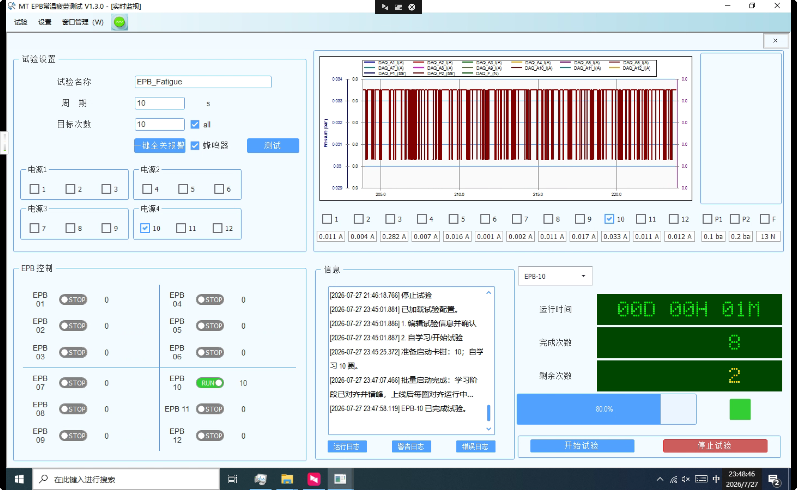

# 报警与落盘一致性修复说明

> 更新日期：2026-07-28
> 适用范围：报警封圈、环形落盘、CSV/BIN 导出、双 NI 采集卡时间戳和历史错误状态修复

## 功能变化

### 报警状态必须有文件证据

报警停机不再先写数据库、后尝试导出。当前圈先保持 `running`，待报警
快照结束后检查 `EPBxx_ALARM` 目录：

- 同通道、同圈号的 CSV 和 BIN 都存在：封为 `alarm`；
- 任一文件缺失或导出异常：封为 `failed`；
- 同一次运行的重复报警由锁存去重；
- 新的单通道或批量运行开始前重置锁存。

这样可以保证每一条 `alarm` 都有可回放的文件证据，并避免上一轮报警
造成下一轮成功圈持续被误记为报警。

### 环形落盘与导出

`EpbDiskWriter` 保持 32 字节二进制记录兼容，同时增加以下保护：

1. 启动时从 SQLite 最新圈恢复逻辑写游标；
2. 导出整圈前校验圈号、从 0 连续的样本序号和有效时间戳；
3. CSV/BIN 先写唯一临时文件，再成对提交；
4. 单圈失败不会阻止其余有效圈继续导出，错误写入
   `export_errors.txt`，最后向调用方汇总抛出；
5. 归档只删除成功生成 CSV/BIN 的圈索引；
6. 环形区已覆盖时，按同通道、同圈号查找已有历史 BIN 快照恢复。

所有 CSV 出口统一使用：

```text
Timestamp,RelativeTimeSeconds,Cycle,SampleIndex,EpbCurrent,GroupPressure
```

`RelativeTimeSeconds` 从文件首条记录起算，使用不变文化格式保留 6 位
小数，并保证旧数据时间戳回拨时仍不倒退。

### 双采集卡时间

Dev1 和 Dev2 继续共用 `_t0` 时间原点，但分别保存上次批次时间。每个
设备只按自身样本数推进时间，主机时间仅用于漂移纠偏，纠偏结果不会让
该设备时间倒退。

### 自适应通道配置

`MTTfTest/App.config` 的 `EpbAdaptiveChannels` 已覆盖 1–12 路。
当前 `EpbControlMode` 仍为 `LegacyFixedTiming`，并保持
`EpbAdaptiveShadowMode=true`，因此默认只进行影子判断，不改变现场 DO
控制；切换正式自适应模式必须另行完成台架验收。

现场运行界面记录：



## 验证

在安装 .NET Framework 4.8 构建工具的开发机上执行：

```powershell
msbuild Tests\AdaptiveControlTests\AdaptiveControlTests.csproj /p:Configuration=Debug /p:Platform=AnyCPU
Tests\AdaptiveControlTests\bin\Debug\AdaptiveControlTests.exe

msbuild Tests\EpbDiskWriterTests\EpbDiskWriterTests.csproj /p:Configuration=Debug /p:Platform=AnyCPU
Tests\EpbDiskWriterTests\bin\Debug\EpbDiskWriterTests.exe
```

预期分别输出 `PASS 15/15` 和 `PASS 8/8`。

## 历史数据修复工具

两个工具默认都是只读预览；只有显式传入 `--apply` 才会写库。写入前
使用 SQLite 在线备份，并执行 `PRAGMA quick_check`。

### 按已知故障窗口修复

```powershell
python Tools\repair_alarm_status.py D:\path\to\index.db
python Tools\repair_alarm_status.py D:\path\to\index.db --apply
```

脚本只处理已审查的通道、时间窗口和圈时长，并要求候选数量严格匹配。
现场数据若与默认数量不同，不应直接覆盖 `--expected-count`；应先人工
复核 SQL 条件和候选明细。

### 按报警快照证据对账

```powershell
python Tools\reconcile_alarm_status_with_files.py D:\path\to\project
python Tools\reconcile_alarm_status_with_files.py D:\path\to\project --apply
```

脚本扫描 `AlarmSnapshots`，仅保留具有同圈 CSV/BIN 配对证据的
`alarm`。它包含现场审查后的默认数量护栏；项目不同或数据继续增长时，
先保存 dry-run JSON 回执并复核，再决定是否传入新的
`--expected-before` 和 `--expected-keep`。

## 回退与注意事项

- 修复历史数据前关闭 EPBTest，避免应用与脚本并发写 `index.db`；
- 保留脚本生成的 `.bak` 文件和 JSON 回执；
- 不直接修改或删除 `.dat` 环形文件；
- 导出出现 `export_errors.txt` 时，先保存该圈的数据库记录和现有快照，
  再排查覆盖或损坏原因；
- 需要恢复旧库时，先关闭程序，保留当前库副本，再用对应 `.bak` 替换。
