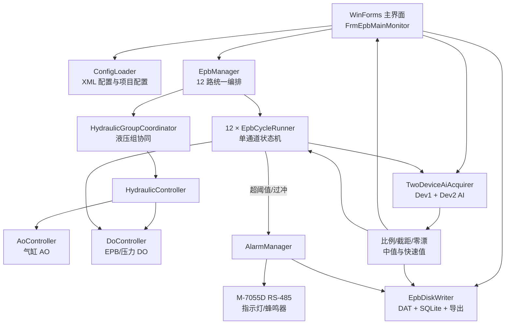
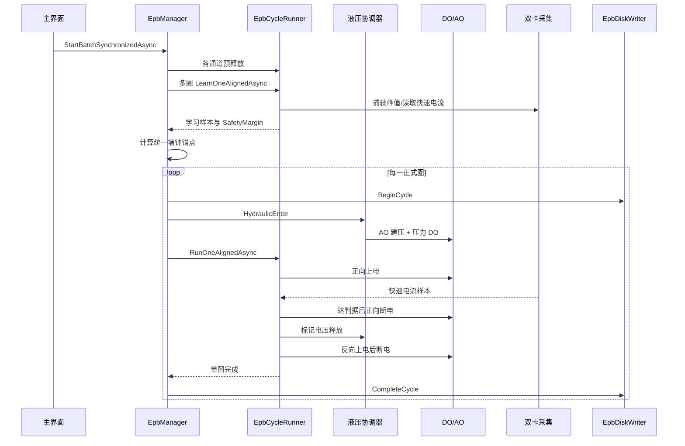

# EPBTest 项目全功能详解

> 文档基线：`feature/safety-margin-freezeA-20260101` 分支，提交 `e60304d`  
> 远程仓库：`yuhoufu/EPBTest`  
> 最后核对日期：2026-07-27  
> 说明：本文以当前参与编译的源码为准；“旧代码备份”、`- Copy`、`Old`、未写入 `.csproj` 的实验文件会单独标记，不作为正式运行链路。

## 1. 项目解决什么问题

EPBTest 是一套运行在 Windows 上的电子驻车制动器（EPB）耐久试验台软件。系统面向最多 12 路 EPB 卡钳，在同一试验任务中完成：

- 12 路卡钳的选择、启停、暂停、恢复和状态管理；
- 两套液压回路的建压、保压、释压及组内协调；
- 四个电源组内的错峰启动，降低同组瞬时供电冲击；
- 两块 NI 数据采集设备的同步采样；
- 12 路电流、2 路压力和 1 路夹紧力的实时显示；
- EPB 正向夹紧、保持、反向释放和周期对齐；
- 启动前预释放与多圈自学习；
- SafetyMargin（切断裕量）闭环学习；
- 过流/过冲报警、声光输出、单通道停机和报警快照；
- 原始数据、工程值、圈级索引、最近圈导出和历史回放；
- 试验参数、通道标定、界面显示偏好和累计进度持久化；
- CAN、串口、TCP 程控电源等辅助设备接入。

系统的核心不是“定时翻转 DO”，而是一个由采集反馈驱动、带液压协同和跨通道时间对齐的并发控制系统。

## 2. 技术栈与运行约束

| 项目 | 当前实现 |
|---|---|
| UI | WinForms、SunnyUI、DevExpress、ZedGraph |
| 运行时 | .NET Framework 4.8 |
| 语言 | C#，部分项目使用 C# 9/latest |
| NI 硬件 | National Instruments DAQmx，核心 DAQ 引用为 x86 |
| 数据库 | System.Data.SQLite 1.0.119 |
| 数据文件 | 固定长度 `.dat` 内存映射文件、CSV、BIN、历史 raw/stat 文件 |
| CAN | 周立功 CAN SDK 封装 |
| 报警输出 | 泓格 M-7055D，RS-485/Modbus RTU 完整 Hex 帧 |
| 电源通信 | 异步 TCP 客户端 |
| 高精度调度 | `Stopwatch` + `HighPrecisionTimer` |

现场运行需要安装匹配版本的 NI-DAQmx、DevExpress/SunnyUI 运行依赖、SQLite 原生组件，以及对应的 CAN/串口驱动。由于 NI DAQmx 引用带有 `processorArchitecture=x86`，现场版本优先使用 x86 构建和运行。

## 3. 解决方案组成

主解决方案为 [`TfTest.sln`](../TfTest.sln)，包含 8 个项目。

| 项目 | 责任 | 关键类 |
|---|---|---|
| `MTTfTest` | 主程序、界面、用户工作流 | `Main_Frm`、`FrmEpbMainMonitor`、`FrmTestSetting`、回放与标定窗体 |
| `Controller` | EPB、液压、批量试验和报警编排 | `EpbManager`、`EpbCycleRunner`、`HydraulicController`、`AlarmManager` |
| `IO.NI` | NI AI/AO/DO 设备封装 | `TwoDeviceAiAcquirer`、`DoController`、`AoController`、`CurrentGuard` |
| `DataOperation` | 数据转换、过滤、落盘、DBC/XML 解析 | `EpbDiskWriter`、`ClsDataFilter`、`ClsXmlOperation` |
| `Config` | 配置模型、XML 加载保存、试验进度 | `ConfigLoader`、`EpbTestRecord`、`AlarmConfigLoader` |
| `Timing` | 周期调度、暂停恢复和超期策略 | `HighPrecisionTimer` |
| `ZlgCanComm` | 周立功 CAN 接口和报文收发 | `zlgcan`、`recvdatathread`、`ClsZlgCommandMaker` |
| `Utils` | 数值工具 | `NumericUtils` |

仓库中的 `ClientOfEMB1`、`ClientOfEMB2` 是两套独立的 TCP 调试客户端解决方案，不在 `TfTest.sln` 的正式主程序构建中。

## 4. 总体架构



### 4.1 依赖方向

- UI 负责装配对象、订阅事件和展示状态，不应成为电流判据的时间基准。
- `EpbManager` 负责跨通道策略，`EpbCycleRunner` 只负责单通道的一圈动作。
- `TwoDeviceAiAcquirer` 同时服务实时控制、实时曲线和落盘，但三条消费者链路使用不同节流策略。
- `EpbDiskWriter` 通过 `IEpbCycleRecorder` 接口被控制层调用，使“开始圈、完成圈、报警圈”具有统一口径。
- XML 配置由 `Config` 项目解析；硬件控制项目消费解析后的强类型配置。

## 5. 程序启动与对象装配

### 5.1 启动入口

[`MTTfTest/Program.cs`](../MTTfTest/Program.cs) 启动 WinForms 消息循环，主壳窗体为 [`Main_Frm`](../MTTfTest/Main_Frm.cs)。

`Main_Frm` 提供：

- 子窗口平铺、垂直、水平布局；
- 试验设置；
- CAN 通信控制；
- DAQ 页面；
- DAQ 标定；
- 字符/原始数据回放；
- 实时监控；
- 扭矩调整入口；
- 程控电源连接、初始化、开关；
- 主串口初始化与接收。

实时试验的主页面是 [`FrmEpbMainMonitor`](../MTTfTest/FrmEpbMainMonitor.cs)。

### 5.2 实时页面加载顺序

`FrmEpbMainMonitor_Load` 的有效装配流程可概括为：

1. 读取 `AIConfig.xml`，取得 Dev1/Dev2 已启用物理通道；
2. 建立物理通道、参数名、比例、截距和零漂映射；
3. 通过 `ConfigLoader.LoadAll` 加载 AO、DO、Test 和 UI 配置；
4. 确保项目目录及项目专属 `Config/TestConfig.xml` 存在；
5. 初始化每路 EPB 的持久化进度；
6. 创建 `EpbDiskWriter`；
7. 创建并初始化 `DoController`、`AoController`；
8. 创建 `TwoDeviceAiAcquirer` 并订阅：
   - `OnEngBatch`：工程值 → 曲线/瞬时值；
   - `OnRawBatch`：原始批次 → 原始数据链路；
   - 快速电流事件：控制判据和峰值捕获；
9. 创建 `EpbManager`，向其注入 DO、AO、采集器、配置、日志和圈记录器；
10. 尝试加载 `AlarmConfig.xml` 并创建 `AlarmManager`；
11. 启动 DAQ、实时曲线刷新、日志与自动保存定时器。

任一关键 AI 配置缺失时，页面会提示并中止初始化，以避免在错误通道映射上控制硬件。

## 6. 用户可见功能

### 6.1 实时监控

实时页显示 12 路 EPB 电流、两路液压压力和夹紧力，主要能力包括：

- 勾选需要显示的曲线；
- 固定时间窗滚动显示；
- 15 条曲线分别使用独立颜色；
- 保存当前曲线勾选状态；
- 恢复默认勾选；
- 将当前勾选保存为新默认值；
- 显示每路试验状态、累计圈数、运行时间和异常；
- 控制显示刷新频率，避免高频 DAQ 回调阻塞 UI；
- 导出运行、警告、错误日志；
- 将 UI 信息区异步覆盖写入 `ui-info.log`。

工程值回调不会每批都直接 `BeginInvoke`。代码为 Dev1/Dev2 分别维护有限队列，每次 UI 调度合并消费多个批次，并限制绘图频率。控制用快速电流值不经过 UI 队列，因此界面卡顿不会改变切断判据。

### 6.2 选择并启动试验

“开始试验”按钮执行的主流程是：

1. 收集 UI 中勾选且允许运行的 EPB 通道；
2. 校验配置、运行状态和目标圈数；
3. 更新 `EpbTestRecord` 的首次开始时间、最近开始时间和状态；
4. 创建本次批量运行的取消令牌；
5. 调用 `EpbManager.StartBatchSynchronizedAsync(channels, learnCycles, token)`；
6. 通过事件持续更新各通道圈数、状态和运行时间；
7. 定时将进度写回项目专属 `TestConfig.xml`。

正式批量启动入口位于 [`Controller/EpbManager.BatchStart.cs`](../Controller/EpbManager.BatchStart.cs)，不是 DAQ 的 `OnEngBatch`。

### 6.3 停止、暂停、恢复

- `PauseChannel`：暂停该路高精度定时器；
- `ResumeChannel`：恢复该路定时器；
- `StopChannel`：取消通道令牌、停止定时器、强制 EPB 输出全关，并通知液压协调器；
- `StopAll`：停止所有通道并执行安全收尾；
- 页面关闭：解除采集事件、停止采集、停止控制、释放报警/DO/AO/SQLite/内存映射资源。

报警停机使用独立路径 `StopChannelOnAlarm`，会先把正在运行的圈封为 `alarm`，再停止通道，避免数据库遗留 `running` 圈。

### 6.4 零点与标定

实时页支持：

- 按 EPB 通道置零/清零；
- 按参数名置零/清零；
- 全部通道置零/清零。

[`FrmDAQCalibrate`](../MTTfTest/FrmDAQCalibrate.cs) 提供独立 DAQ 标定工作流：

- 创建 NI AI 任务并实时读取；
- 展示各参数实时值、最大值和最小值；
- 控制曲线显隐；
- 执行零点标定；
- 停止标定并安全释放任务；
- 将零漂结果更新到 AI 配置。

### 6.5 参数设置

[`FrmTestSetting`](../MTTfTest/FrmTestSetting.cs) 提供：

- 试验名称、负责人、描述、周期和学习圈数；
- 统一目标圈数或每路独立目标圈数；
- 每路启用状态、累计状态和进度重置；
- 12 路正反向 DO 映射；
- 两路压力 DO 和两路气缸 AO 参数；
- AI 通道、比例、截距、单位、类型和零漂；
- 液压模式、压力阈值、时长和保持时间；
- 电源组成员和错峰时间；
- 每路 EPB 的电流阈值与阶段时序；
- 数据存储目录选择；
- 配置加载、校验和保存；
- 创建/更新项目专属配置。

### 6.6 历史回放与导出

项目保留两类回放界面：

1. `FrmPlayBack`
   - 浏览历史文件；
   - 按文件名和扩展名筛选；
   - 读取配置；
   - 显示力、电流、DAQ 电流、DAQ 扭矩；
   - 导出选定数据。

2. `FrmRawPlayBack`
   - 选择数据目录和设备；
   - 加载项目 XML 和 CAN DBC；
   - 读取 raw 数据；
   - 解析方向、报文和比例；
   - 显示/隐藏曲线；
   - 水平平移时间轴；
   - 导出 DAQ 工程数据。

`FrmRawPlayBack_Old.cs` 存在于仓库，但没有列入主项目编译项，属于历史实现。

### 6.7 报警面板输出测试

[`FrmAlarmPanelTest`](../MTTfTest/FrmAlarmPanelTest.cs) 是当前分支新增的维护工具，可直接测试：

- 12 路报警指示输出；
- 蜂鸣器输出；
- 全部关闭；
- 当前输出状态。

该工具复用正式 `AlarmManager`，用于现场接线和 M-7055D 联调。

## 7. 一次完整试验的控制链



### 7.1 预释放

正式启动前，`PreReleaseBatchStaggeredAsync` 对选中通道执行反向预释放。预释放的目的：

- 将卡钳统一回到可预测的机械起点；
- 清除上次异常退出可能遗留的夹紧状态；
- 同电源组内错峰，避免同时反向上电。

`EpbCycleRunner.PreReleaseAsync` 以反向 DO 驱动，保持 `PreReleaseKeepMs` 后关闭。

### 7.2 学习阶段

每个通道进入学习聚合：

- `BeginLearnAggregation` 清理时间样本；
- `BeginSafetyMarginLearning` 清理裕量轨迹；
- 多次执行 `LearnOneAlignedAsync`；
- 每圈产生 `LearnSample`；
- `FinalizeLearnAggregation` 得出阶段时间；
- `FinalizeSafetyMarginLearning` 得出正式运行裕量。

学习圈与正式圈使用同一批量时间框架，仍按电源组错峰和液压组协调。

### 7.3 SafetyMargin 两套算法

运行模式由 `App.config` 的 `EpbSafetyMarginControlMode` 决定。判据本身是：

`current + SafetyMarginA >= ForwardA`

也就是等价地在约 `ForwardA - SafetyMarginA` 处触发断电；裕量越大，触发越早。两套调整模式为：

- `Legacy20251010`：误差为 `Imax - ForwardA`，死区外使用固定比例系数和单步上下限调整；
- `FreezeA20260101`：上调和下调使用不同增益；出现过冲后启动“下调冻结窗口”，防止下一圈轻微欠冲立即把裕量大幅拉回。

学习阶段不会用单圈结果直接覆盖正式 `_safetyMarginA`，而是只更新临时 `_learnMargin`。学习结束时：

1. 取最后 N 圈；
2. 计算中位数；
3. 用 MAD（中位绝对偏差）剔除异常；
4. 对剩余样本再次取中位数；
5. 限制在允许范围内后一次性写入正式裕量。

进入正式运行后两种模式存在差异：

- `Legacy20251010` 保持学习所得正式裕量，不按正式圈峰值继续自调；
- `FreezeA20260101` 会在每个正式圈的峰值异步封口完成后继续调整正式裕量，并沿用上调快、下调慢和过冲后冻结下调的策略。

### 7.4 正式单圈

当前正式单圈的主要阶段是：

1. 请求液压进入：所属液压组开始建压；
2. 正向上电；
3. 忽略 `PeakIgnoreMs` 内的启动涌流；
4. 等待电流满足 `current + SafetyMarginA >= ForwardA`；已学习到正向空行程电流时，也允许“高于空行程且窗口足够平坦”的限流平台判据；
5. 达成或超时后立即正向断电；
6. 通知液压协调器该通道已完成电压阶段；
7. 保持 `HoldMs`；
8. 反向上电并忽略涌流；
9. 在 `RevDecayRigidMaxMs` 内等待电流降至 `RevDecayLimitA`；
10. 再执行固定反向空行程 `RevEmptyFixedMs`；
11. 反向断电；
12. 通过尾段补偿对齐统一圈截止时间。

若正向夹紧判据在 `FwdOnLimitMs` 内未满足，本圈失败、触发 `ClampTimeout` 报警并走高优先级断电。

### 7.5 批量同步和错峰

系统同时解决两个时间约束：

- 同一电源组的卡钳不能同一时刻启动；
- 所有运行卡钳的“圈边界”又要保持可比较。

实现方式：

- 以 UTC 墙钟计算下一统一锚点；
- 组内位置乘 `StaggerMs` 得到通道相位；
- `HighPrecisionTimer` 按锚点 + 相位触发；
- 尾段用 `tailBase - phase - lateness` 补偿；
- `deadlineUtc` 是硬截止，防止通道因单圈耗时累积漂移。

默认电源组为：

| 电源组 | EPB | 默认错峰 |
|---|---|---|
| 1 | 1、2、3 | 800 ms |
| 2 | 4、5、6 | 800 ms |
| 3 | 7、8、9 | 800 ms |
| 4 | 10、11、12 | 800 ms |

## 8. 液压控制

### 8.1 硬件分组

默认两路液压：

| 液压路 | 成员 | AO | 压力 DO | 压力 AI |
|---|---|---|---|---|
| 1 | EPB1–6 | `Dev1/ao0` | `Dev1/port2/line0` | `Dev1/ai6` |
| 2 | EPB7–12 | `Dev2/ao0` | `Dev2/port2/line0` | `Dev2/ai7` |

### 8.2 建压模式

`HydraulicMode` 支持：

- `ByPressure`：达到 `PressureThresholdBar`；
- `ByDuration`：运行到 `DurationMs`；
- `Either`：压力或时间任一条件先满足。

达到条件后可继续保持 `HoldAfterReachedMs`。

### 8.3 组协调

`HydraulicGroupCoordinator` 以液压路为粒度维护参与者：

- 某组首个通道进入电气阶段时启动建压；
- 同组其他通道复用本次液压状态；
- 每个通道完成夹紧后调用 `MarkVoltageReleaseAsync`；
- 所有参与者均释放后统一释压；
- 取消或异常时有兜底释放逻辑。

因此，单通道不能擅自关闭整组液压，否则会影响同组仍在夹紧的通道。

## 9. NI 数据采集

### 9.1 通道

默认 AI 配置为 15 路：

- Dev1：EPB1–6 电流 + Pressure_1；
- Dev2：EPB7–12 电流 + Force + Pressure_2。

每条记录包含：

- 物理通道；
- 参数名；
- 单位；
- 变换斜率；
- 变换截距；
- 参数类型；
- 是否启用；
- 零位漂移。

工程值计算口径为：

`engineering = (raw - zeroDrift) × scale + offset`

运行时执行“动态置零”后，还会再减去该参数当前会话保存的动态零点偏移。

### 9.2 双卡时间基准

`TwoDeviceAiAcquirer` 在启动时创建统一 `Stopwatch` 时间基准。Dev1 和 Dev2 回调时间都从同一基准换算，而不是分别使用各自回调到达时刻作为曲线零点。这是两卡曲线同步的关键。

默认采样设置：

- `DaqFrequency=2000` Hz；
- `SamplesPerChannel=20`；
- 理论每批约 10 ms。

### 9.3 三种消费口径

| 用途 | 数据口径 | 原因 |
|---|---|---|
| 控制 | 快速代表值/快速电流事件 | 降低夹紧切断延迟 |
| UI | 过滤后的工程批次 | 曲线更稳定，且允许节流 |
| 落盘 | 带绝对时间戳的批次 | 保留可追溯性和跨设备对齐 |

快速代表值可配置为尾样本、尾部中位数或尾部截尾平均值。控制层还可接收逐样本快速事件，用于峰值跟踪和更精确的阈值判断。

### 9.4 过滤

`ClsDataFilter` 包含：

- 因果中值流：无未来样本依赖，适合控制；
- 对称中值流：有固定延迟，适合显示/报告；
- EWMA；
- 斜率限制；
- 按 key 维护独立滤波状态。

### 9.5 回调节拍诊断

`App.config` 可配置：

- `DaqCallbackTimingLog=off|anomaly|all`；
- 最小日志间隔；
- 异常倍率阈值。

诊断记录批量大小、采样率、理论批周期、实际回调间隔和到达延迟，用于排查驱动阻塞、线程调度和双卡不同步。

### 9.6 自动重启

采集类维护设备上下文和回调状态，在设备异常时可按设备重启 AI 任务。停止和释放阶段会取消处理循环并释放两套 NI Task/Reader。

## 10. NI 输出控制

### 10.1 DO

`DoController` 从 `DOConfig.xml` 创建每台 NI 设备的端口任务，并在内存中维护端口位状态。

主要操作：

- `SetEpbForward(ch)`；
- `SetEpbReverse(ch)`；
- `SetEpbOff(ch)`；
- `SetEpbOffHighPriority(ch)`；
- `PressureOn(id)` / `PressureOff(id)`；
- `AllOff()`。

每路 EPB 占用两个 DO：正向和反向。切换方向时会保证同一路不会同时置正、反。高优先级断电走独立工作队列，用于报警时尽快关闭输出。

默认映射：

- EPB1–6：Dev1 port0/port1；
- EPB7–12：Dev2 port0/port1；
- 两路压力阀：各设备 port2 line0。

### 10.2 AO

`AoController` 管理 `Cylinder1` 和 `Cylinder2`：

- 按百分比写输出；
- 按目标压力换算输出；
- 应用 `ScaleK` 和 `Offset`；
- 将输出限制在配置电压范围；
- `ResetAll` 将所有 AO 安全归零。

## 11. 报警系统

### 11.1 报警触发

当前控制链关注电流阈值和峰值。报警阈值可使用全局 `OvershootAlarmDeltaA`，也可在单个 EPB 映射上覆盖。

当通道报警时：

1. `EpbCycleRunner` 发出 `AlarmRaised`；
2. `EpbManager.OnRunnerAlarmRaised` 接收；
3. 当前圈以 `alarm` 状态封圈；
4. 使用高优先级路径关闭该路 EPB 输出；
5. 停止该通道定时器和取消令牌；
6. 激活对应报警灯；
7. 根据配置决定蜂鸣器；
8. 异步导出报警快照。

### 11.2 M-7055D 输出

`AlarmConfig.xml` 配置：

- COM 口、波特率、数据位、校验、停止位；
- EPB1–12 到两个模块 DO 的映射；
- 蜂鸣器映射；
- 单线圈开/关完整 Hex 帧；
- 全关完整 Hex 帧；
- 响应等待、超时和重试；
- 蜂鸣器去抖、重新布防延时；
- 快照圈数和快照冷却时间。

`AlarmManager` 对串口写入使用异步门控，避免多个报警并发交叉写帧。`ClearAllAsync` 发送全关命令、清理内存报警状态，并进入短暂重布防期。

### 11.3 报警快照

默认导出报警通道的当前圈和最近 9 个已关闭圈，并同时导出其他正在运行通道用于对比。

目录形态：

`StoreDir\TestName\AlarmSnapshots\yyyyMMdd_HHmmss-EPBxx\EPBxx(_ALARM)\...`

同一通道在 `SnapshotCooldownMs` 内重复报警不会重复生成大量快照。

## 12. 数据落盘

### 12.1 当前正式落盘链

当前正式链使用 [`EpbDiskWriter`](../DataOperation/EpbDiskWriter.cs)：

- 每个 EPB 一个固定大小 `.dat` 文件；
- 每条采样记录固定 32 字节；
- Windows 内存映射分块写入；
- SQLite 保存圈级索引；
- 支持 completed/alarm/running 状态；
- 支持 CSV/BIN 导出；
- 支持最近 N 圈保留策略和报警快照。

### 12.2 32 字节记录格式

| 偏移 | 类型 | 含义 |
|---:|---|---|
| 0 | Int64 | `DateTime.ToBinary()` 时间戳 |
| 8 | Int32 | 圈号，0 表示 Free-Run |
| 12 | Int32 | 圈内样本序号 |
| 16 | Double | EPB 电流 |
| 24 | Double | 所属组压力 |

### 12.3 内存映射

- 默认每个通道文件 384 MB；
- 记录写满后按容量取模，形成环形覆盖；
- 仅映射当前需要的 64 MB 窗口；
- 映射基址按 64 KB 对齐；
- 避免 12 个大文件整文件映射造成 32 位进程地址空间不足。

### 12.4 SQLite 索引

表名为 `epb_cycles`：

| 字段 | 含义 |
|---|---|
| `epb_id` | EPB 通道 |
| `cycle_number` | 全局圈号 |
| `start_time` / `end_time` | 圈起止时间 |
| `start_position` | `.dat` 中的记录起始位置 |
| `sample_count` | 圈内有效样本数 |
| `status` | `running`、`completed`、`alarm` |

`(epb_id, cycle_number)` 唯一。新会话从 `GetLastCycleNumber + 1` 开始，不能复用旧圈号。

### 12.5 圈生命周期

- `BeginCycle`：创建 `running` 索引；
- `WriteBatch`：写入电流和压力并更新样本进度；
- `CompleteCycle`：正常封为 `completed`；
- `AlarmCycle`：异常封为 `alarm`；
- 未开正式圈时，只有显式启用 Free-Run 才写 `cycle_number=0`。

### 12.6 RunCount 权威口径

项目已存在 `index.db` 时，启动阶段从数据库统计：

`COUNT(status IN ('completed', 'alarm'))`

该值回填 `EpbTestRecord.RunCount` 并写回项目配置。首次新建项目、尚无数据库时不会用 0 覆盖 XML 中的已有记录。

因此：

- 正常完成圈计数；
- 报警中断圈计数；
- 尚未封圈的 `running` 不计数；
- UI、XML 和数据库以已封圈记录为共同口径。

### 12.7 历史数据链

`ClsDaqAIContext`、`ClsDeviceContext` 等类仍提供早期 raw/stat 异步落盘：

- 队列接收批次；
- 补齐批内时间戳；
- 定时异步 Flush；
- 分时段生成文件。

它们服务旧数据格式和回放兼容，不应与 `EpbDiskWriter` 的圈级正式链混为一谈。

## 13. 配置体系

### 13.1 配置文件

| 文件 | 用途 |
|---|---|
| `AIConfig.xml` | AI 物理通道、工程换算、零漂 |
| `AOConfig.xml` | 气缸 AO、压力/电压范围和标定 |
| `DOConfig.xml` | 12 路 EPB 正反向 DO、压力 DO |
| `TestConfig.xml` | 试验基本信息、进度、液压、电源组、单圈参数 |
| `UIConfig.xml` | 曲线勾选、启用状态和默认状态 |
| `AlarmConfig.xml` | M-7055D 串口、映射、Hex 命令和报警行为 |
| `App.config` | DAQ 频率、诊断、SafetyMargin 模式、CAN/串口/电源兼容参数 |
| `CAN_V4_3_0.dbc` | CAN 报文和信号定义 |

### 13.2 默认配置与项目配置

程序目录的 `Config/TestConfig.xml` 是模板/默认配置。实际项目采用：

`StoreDir\TestName\Config\TestConfig.xml`

首次创建项目时复制默认配置；运行进度优先写项目配置，防止多个试验项目互相覆盖。

### 13.3 TestConfig 结构

`Basic`：

- `TestName`
- `TestTarget`
- `IsSameCycleForAllEpb`
- `TestCycle`
- `LearnCycle`
- `StoreDir`
- `Owner`
- `Description`

`Timer`：

- `OverrunPolicy`

`EpbRecords`：

- Id、Enabled；
- 首次/最近开始时间；
- 累计运行时间；
- TotalCount、RunCount；
- Status。

`Hydraulics`：

- Id、Enabled、Mode；
- SetPercent；
- PressureThresholdBar；
- DurationMs；
- HoldAfterReachedMs；
- PressureDoId；
- Members。

`EpbCycleRunnerConfig` 每路参数：

- `ForwardA`
- `SafetyMarginA`
- `FwdOnLimitMs`
- `HoldMs`
- `RevDecayLimitA`
- `RevDecayRigidMaxMs`
- `RevEmptyFixedMs`
- `PreReleaseKeepMs`
- `PeakIgnoreMs`

`ElectricalGroups`：

- Id；
- StaggerMs；
- Members。

## 14. 试验进度状态机

`EpbTestRecord` 保存每路独立状态：

| 状态 | 含义 |
|---|---|
| `NotStarted` | 尚未开始 |
| `Running` | 正在运行 |
| `Paused` | 暂停 |
| `Alarm` | 报警停机 |
| `Completed` | 达到目标圈数 |

关键规则：

- `StartTime` 只记录首次开始；
- `LatestStartTime` 每次重新启动/恢复时更新；
- 运行时间以持久化基值 + 本次运行增量计算；
- 完圈事件更新 RunCount；
- 达目标后切换 Completed；
- 重置保留 TotalCount，但清空运行进度与时间。

页面自动保存定时器会将 12 路状态写回项目 XML。

## 15. 高精度定时器

`HighPrecisionTimer` 支持：

- 指定首次延迟；
- 有限次数或持续运行；
- Pause/Resume/Stop；
- 每圈异步工作；
- 多种 Overrun 策略。

策略包括：

- `RunToCompletionSkipMissed`：当前任务完成后跳过已错过的节拍；
- `SkipNextIfOverrun`：超时则跳过下一次；
- `AlignToWallClock`：持续回到墙钟边界；
- `Throw`：超期抛出异常。

批量正式试验主要使用 `AlignToWallClock`，配合统一 UTC 锚点和每通道相位。

## 16. CAN、DBC、串口和电源辅助功能

### 16.1 CAN

`ZlgCanComm` 封装：

- 设备打开/关闭；
- CAN 初始化；
- 帧发送与接收线程；
- 自动发送；
- 周期报文；
- 接收缓存。

`ClsDbcParser` 解析：

- 消息 ID；
- 信号起始位和长度；
- Intel/Motorola 字节序；
- 有符号/无符号；
- Factor、Offset、Min、Max、Unit；
- 按信号名查找换算参数。

`ClsBitFieldParser` 提供夹紧力、扭矩、电流、故障位等位域解析。

### 16.2 程控电源

`Main_Frm` 通过异步 TCP 客户端连接电源服务：

- 按电源索引连接；
- 设置电压、电流和功率上下限；
- 打开/关闭指定通道；
- 接收服务端响应；
- 更新菜单连接状态。

四个逻辑电源组用于 12 路 EPB 的错峰编排；TCP 电源接口属于设备控制辅助链。

### 16.3 主串口与温控

主窗体保留通用串口初始化、接收和释放。`ClsTempControl` 可：

- 格式化设温命令；
- 异步发送目标温度；
- 等待设备响应；
- 超时取消；
- 释放客户端。

温控目前不是批量 EPB 主链的强制步骤。

## 17. 日志与排障

### 17.1 三类运行日志

`FormLoggerAdapter` 将日志写入内存队列并显示在 UI：

- Info；
- Warn；
- Error。

用户可分别导出：

- `RunLog.txt`
- `WarnLog.txt`
- `ErrorLog.txt`

队列有最大长度，旧记录会被移除，防止长时间运行无限占用内存。

### 17.2 UI 日志

信息显示区变更会异步写入 `ui-info.log`，写入使用 `SemaphoreSlim` 串行化，避免 UI 线程直接执行文件 I/O。

### 17.3 推荐排障顺序

1. 检查项目配置路径和当前项目名；
2. 检查 AI/DO/AO 物理通道与现场接线；
3. 检查 Dev1/Dev2 DAQ 是否都能启动；
4. 临时启用 `DaqCallbackTimingLog=anomaly`；
5. 查看 Warn/Error；
6. 检查 `index.db` 是否存在悬挂 `running` 圈；
7. 报警硬件问题先用报警面板测试窗体；
8. 两卡曲线问题核对绝对时间戳，不要用 UI 到达时间判断；
9. 控制阈值问题对比快速电流、过滤电流和最终落盘电流。

## 18. 构建与运行

建议使用 Visual Studio 2022 Developer PowerShell：

```powershell
msbuild TfTest.sln /p:Configuration=Debug /p:Platform=x86
```

发布构建：

```powershell
msbuild TfTest.sln /p:Configuration=Release /p:Platform="Any CPU"
```

尽管解决方案声明 Any CPU，连接 NI 硬件的正式版本仍建议 x86。构建前需确保：

- `packages/` 中 NuGet 包完整；
- DevExpress 24.2 可解析；
- NI Common/DAQmx 程序集版本匹配；
- SQLite.Interop.dll 随目标平台复制；
- `MTTfTest/Config` 内容复制到输出目录。

程序从当前工作目录读取 `Config`，因此不要从不含配置文件的目录直接启动 exe。

## 19. 正式代码、兼容代码和未编译代码

### 19.1 当前正式主链

- `FrmEpbMainMonitor`
- `EpbManager` + `EpbManager.BatchStart`
- `EpbCycleRunner` + `EpbCycleRunner.Advance.Sync`
- `HydraulicController`
- `HydraulicGroupCoordinator`
- `TwoDeviceAiAcquirer`
- `DoController`
- `AoController`
- `EpbDiskWriter`
- `AlarmManager`

### 19.2 兼容/辅助代码

- `FrmPlayBack`、`FrmRawPlayBack`：历史格式回放；
- `ClsDaqAIContext`、`ClsDeviceContext`：旧 raw/stat 落盘；
- `ClsAutoLearnProc`、`ClsAutoLearnDetector`：旧力值学习；
- `ClsEPBControler`、`ClsEMBControler`：早期控制封装；
- `ClientOfEMB1/2`：独立 TCP 测试程序。

### 19.3 不参与主构建或明显备份

- `Controller/EpbManager - Copy.cs`
- `Controller/EpbCycleRunner - Copy.cs`
- `Controller/HydraulicOrchestrator.cs`（未列入 `Controller.csproj`）
- `DataOperation/ClsEpbDualDeviceManager.cs`（未列入 `DataOperation.csproj`）
- `DataOperation/ClsEpbDeviceContext.cs`（未列入 `DataOperation.csproj`）
- `MTTfTest/FrmRawPlayBack_Old.cs`（未列入 `MTTfTest.csproj`）
- `IO.NI/TwoDeviceAiAcquirer - 备份-20250903.cs`
- `旧代码备份/`
- `Backups/`

修改功能时应先检查 `.csproj` 的 `<Compile Include>`，避免改到未参与编译的同名旧文件。

## 20. 关键扩展点

### 20.1 增加新的单圈判据

优先修改 `EpbCycleRunner`，不要在 UI 回调中加入硬件控制。若判据需要新采集值：

1. 在 `TwoDeviceAiAcquirer` 暴露快速读取或事件；
2. 注入 `EpbCycleRunner`；
3. 为超时、取消和断电提供统一 `finally`；
4. 在学习和正式运行两条路径中决定是否同时生效；
5. 更新 `EpbCycleRunnerConfig` 与 XML 保存加载。

### 20.2 增加新硬件通道

1. 更新 AI/AO/DO XML；
2. 更新配置模型和解析器；
3. 更新设备控制器映射；
4. 更新 UI 和曲线；
5. 更新落盘字段或说明；
6. 验证 x86 驱动兼容性。

### 20.3 增加报警规则

1. 在单通道 Runner 中产生结构化报警原因；
2. 由 `EpbManager` 统一执行封圈和停机；
3. `AlarmManager` 只负责外部输出，不负责试验计数；
4. 更新快照元数据；
5. 保证重复报警幂等。

### 20.4 更改数据格式

`SampleRecord.Size=32` 与文件读取、内存映射、CSV/BIN 导出强耦合。新增字段必须同步修改：

- 结构布局；
- 写入和读取；
- 文件大小/容量计算；
- 导出/导入；
- 回放；
- 版本识别与旧文件兼容。

## 21. 已知工程风险

- 仓库包含较多旧版同名文件，容易误改；
- UI 主窗体文件超过 5000 行，装配、显示、旧 DAQ 和日志代码耦合较高；
- 当前无独立自动化测试项目，硬件状态机回归主要依赖现场；
- Debug/Release 平台口径与 NI x86 依赖存在潜在不一致；
- `App.config` 保留大量旧 CAN/串口参数，部分不属于当前 EPB 主链；
- 项目配置、默认配置和输出目录配置并存，启动目录错误会读到错误文件；
- 环形 `.dat` 会覆盖旧样本，圈索引和保留策略必须与容量匹配；
- 报警模块使用现场预制完整 Hex 帧，更换模块地址或接线后必须同步配置；
- 旧回放格式与新 `EpbDiskWriter` 格式并存，需要明确数据来源。

## 22. 维护者快速定位表

| 想修改的功能 | 首要文件 |
|---|---|
| 开始试验按钮 | `MTTfTest/FrmEpbMainMonitor.cs` |
| 批量学习/同步启动 | `Controller/EpbManager.BatchStart.cs` |
| 单路启停和报警收尾 | `Controller/EpbManager.cs` |
| 单圈正反向控制 | `Controller/EpbCycleRunner.cs` |
| 对齐学习和 SafetyMargin | `Controller/EpbCycleRunner.Advance.Sync.cs` |
| 液压建压 | `Controller/HydraulicController.cs` |
| 同液压组统一释放 | `Controller/HydraulicGroupCoordinator.cs` |
| AI 双卡采集 | `IO.NI/TwoDeviceAiAcquirer.cs` |
| EPB/压力 DO | `IO.NI/DoController.cs` |
| 气缸 AO | `IO.NI/AoController.cs` |
| 圈级数据与 SQLite | `DataOperation/EpbDiskWriter.cs` |
| 配置加载保存 | `Config/ConfigLoader.cs` |
| 运行进度 | `Config/EpbTestRecord.cs` |
| 报警策略 | `Controller/Alarm/AlarmManager.cs` |
| 报警配置 | `MTTfTest/Config/AlarmConfig.xml` |
| 试验参数界面 | `MTTfTest/FrmTestSetting.cs` |
| DAQ 标定 | `MTTfTest/FrmDAQCalibrate.cs` |
| 原始回放 | `MTTfTest/FrmRawPlayBack.cs` |
| CAN 底层 | `ZlgCanComm/zlgcan.cs` |

## 23. 一句话掌握系统

EPBTest 以双 NI 采集卡提供统一时间基准，由 `EpbManager` 在液压组和电源组约束下编排 12 个 `EpbCycleRunner`；每路依据实时电流完成夹紧/释放状态机，并把正常圈或报警圈统一写入 `EpbDiskWriter`，最终由 WinForms 页面呈现、配置和回放整个试验生命周期。
