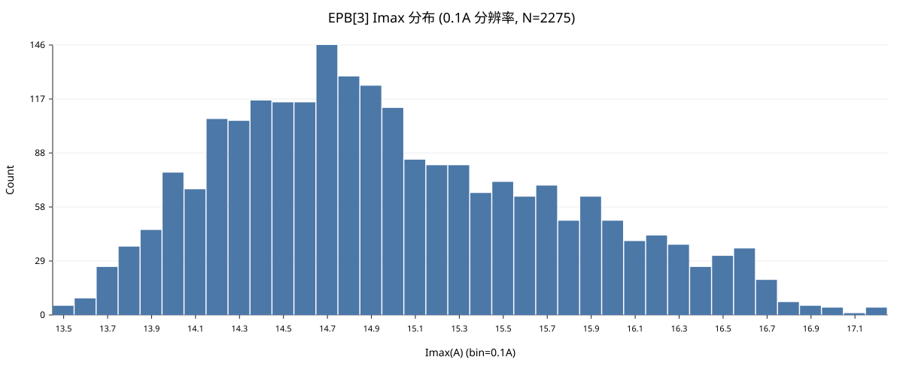
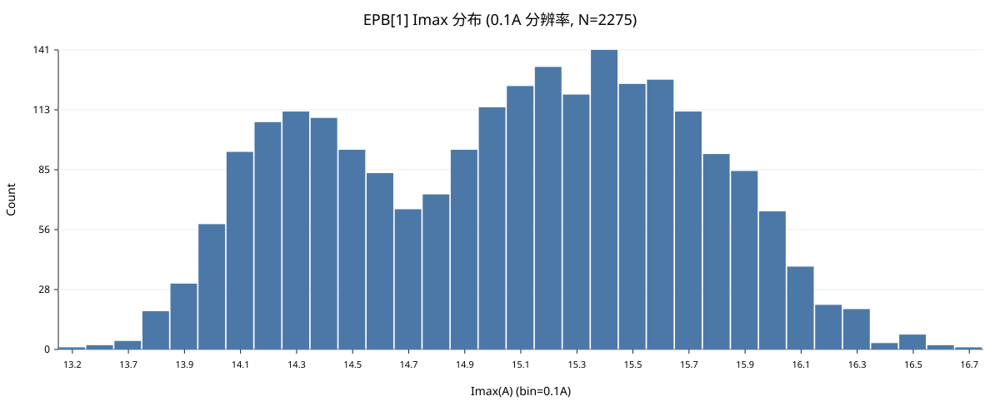

# EPB 峰值控制精度分析与优化报告 (2025-12-31)

## 1. 问题背景
在 2025-12-31 的耐久试验中，观察到 EPB 电流峰值控制精度存在波动。尽管设定了阈值（如 15A），实际峰值（`Imax`）有时会冲到 16A 以上，有时又不足 14A。

为了提高控制精度，我们对 `ErrorLog_1231_1.txt` 中的 4550 条运行记录进行了详细的数据提取与相关性分析。

## 2. 数据分析结论

### 2.1 关键统计数据
基于 4550 条样本的统计分析（`Threshold_Analysis_1231.csv`）：

*   **平均过冲量 (Overshoot)**：**1.47A**
    *   定义：`Overshoot = Imax - Cutoff_Val`（实际峰值 - 断电瞬间电流）
    *   这意味着断电后，电流平均还会依靠惯性爬升 1.47A。
*   **过冲波动性 (不稳定源头)**：
    *   **标准差 (Std Dev)**：**0.66A**
    *   **极值范围**：**-0.20A** (欠冲) ~ **3.64A** (严重过冲)
    *   **结论**：这个 ±0.66A 的随机波动是导致控制精度不稳的核心原因。

### 2.2 相关性分析 (Correlation)
我们分析了 `Imax_A` 与各个系统变量的相关系数 (Pearson r)：

| 变量 | 相关系数 (r) | 解读 |
| :--- | :--- | :--- |
| **Samples (运行耗时/点数)** | **0.45** | **最强正相关**。夹紧过程越长，最终冲出的峰值越高。可能与电机发热或机械阻力变化有关。 |
| **Cutoff_Val (断电电流)** | **0.41** | **强正相关**。断电越晚，峰值越高（符合物理规律）。 |
| **CallbackInterval_ms (系统延迟)** | **-0.009** | **无相关性**。无论回调延迟是 1ms 还是 16ms，产生的过冲量几乎没有区别。 |
| **ArrivalDelay_ms (到达延迟)** | **-0.004** | **无相关性**。 |

### 2.3 核心发现
1.  **延迟不是主因**：数据表明，软件系统的调度延迟（Jitter）并不是导致峰值波动的主要原因。单纯优化软件延迟（如从 10ms 降到 5ms）无法消除物理惯性带来的波动。
2.  **惯性是主因**：控制精度的瓶颈在于**机械/电气惯性（Overshoot）的随机性**。

## 3. 优化方案实施

针对上述分析，我们实施了“双管齐下”的优化策略：

### 3.1 引入“自适应提前断电”算法 (Adaptive Safety Margin)
*   **原理**：既然惯性波动不可控，就让算法去适应它。系统根据上一圈的实际误差，自动调整下一圈的提前断电量（`SafetyMargin`）。
*   **代码位置**：`Controller/EpbCycleRunner.cs` -> `RunOneAsync`
*   **逻辑**：
    ```csharp
    // 伪代码
    var error = peak.MaxAmp - TargetThreshold;
    if (abs(error) > 0.1A) {
        // 学习率 alpha = 0.3
        _safetyMarginA += error * 0.3; 
        // 限幅保护：0.5A ~ 4.0A
    }
    ```
*   **预期效果**：能够动态吸收 1.47A ± 0.66A 的惯性波动，使 `Imax` 收敛于目标阈值。

### 3.2 降低控制回路延迟 (Latency Reduction)
*   **原理**：虽然延迟不是主因，但更低的延迟能提供更密集的采样点，提高捕捉 `Cutoff` 点的分辨率。
*   **配置修改**：`MTTfTest/App.config`
    *   `SamplesPerChannel`: **20 -> 10**
    *   `DaqFrequency`: **2000Hz** (保持不变)
*   **效果**：控制回路的理论响应周期从 **10ms** 降低至 **5ms**。

## 4. 后续建议
1.  **观察收敛性**：运行新版本后，关注日志中 `截断值` 字段的 `[...]` 部分，观察 `SafetyMargin` 是否能稳定收敛。
2.  **时长补偿 (高级)**：鉴于 `Samples` 与 `Imax` 存在正相关，如果自适应算法仍有残差，未来可考虑在算法中加入“运行时长补偿因子”。

---
*记录人：GitHub Copilot*
*日期：2025-12-31*

## 5. Imax_A 相关性分析（基于 12.31 阈值记录 CSV）

数据源：`d:\EPB_Data\实测数据\log\12.31\Threshold_Analysis_1231.csv`（共 4550 条有效记录；按通道自动选取出现最多的两个 EPB：EPB[3], EPB[1]）。

### 5.1 整体相关性（Pearson r）

Imax_A 与各因素相关系数（r）：


| 因素 | r(Imax_A, 因素) | 备注 |
|---|---:|---|
| Cutoff_Val | 0.4080 | 断电触发点电流 |
| SafetyMargin | 0.0336 | 提前断电裕量（当日志中存在时） |
| CallbackInterval_ms | -0.0094 | DAQ 回调节拍（越大越抖） |
| ArrivalDelay_ms | -0.0037 | 数据时间到回调到达的延迟 |
| Samples | 0.4523 | 运行耗时/有效段长度的代理指标 |

同时，过冲量 Overshoot = Imax_A - Cutoff_Val 与各因素的相关系数：


| 因素 | r(Overshoot, 因素) |
|---|---:|
| Cutoff_Val | 0.2403 |
| SafetyMargin | 0.1065 |
| CallbackInterval_ms | -0.0097 |
| ArrivalDelay_ms | -0.0038 |
| Samples | 0.3926 |

### 5.2 两个 EPB 的 Imax 分布（0.1A 分箱）

#### EPB[3]

- 样本数 N=2275

- Overshoot: mean=1.404A, std=0.708A, P10=0.546A, P50=1.298A, P90=2.432A

- Imax: mean=15.054A, std=0.756A




#### EPB[1]

- 样本数 N=2275

- Overshoot: mean=1.544A, std=0.593A, P10=0.715A, P50=1.605A, P90=2.312A

- Imax: mean=15.100A, std=0.635A





> 说明：若你希望固定分析特定两个通道（例如 EPB[1] 与 EPB[3]），可以告诉我通道号，我会把“自动选取 top2”改为“指定通道”。

