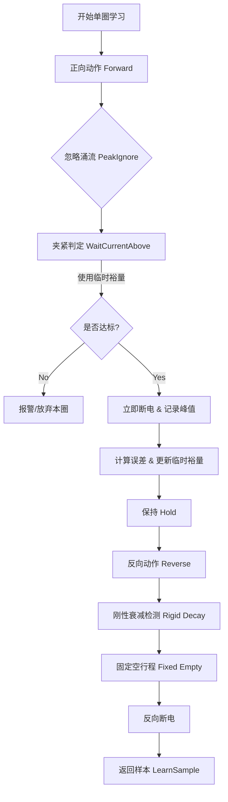

# EPB 自学习逻辑详解

**日期**: 2025-12-31
**关联文件**: `Controller/EpbCycleRunner.Advance.Sync.cs`
**模块**: EPB 控制核心 (Controller)

## 1. 概述

EPB（电子驻车制动）自学习机制是试验启动前的关键步骤。由于不同批次的卡钳、电机以及电源特性存在差异，固定的控制参数往往无法兼顾“快速运行”与“稳定判定”。

本系统的自学习逻辑旨在自动摸索出适合当前被测件的物理特性参数，主要包含两大目标：
1.  **时序参数自学习 (Timing Learning)**：确定正反向动作的最佳持续时间，优化控制节拍。
2.  **安全裕量自适应 (Safety Margin Adaptive Learning)**：动态调整电流判定裕量，使实际峰值电流紧贴目标阈值，防止过冲或误判。

---

## 2. 核心流程图解

自学习的单圈核心逻辑位于 `LearnOneAlignedCoreAsync` 方法中。其执行流如下：

---

## 3. 时序参数自学习 (Timing Learning)

### 3.1 正向阶段 (Forward)
*   **策略**：合并判据。
*   **逻辑**：
    1.  上电后等待 `_peakIgnoreMs`（忽略启动涌流）。
    2.  不再区分“空行程”与“夹紧爬坡”，直接检测电流是否超过 `_posThrA + margin`。
    3.  一旦达标，立即断电，记录耗时。
*   **输出**：`TFwdPeakDecayMs` (取忽略涌流时长)。

### 3.2 反向阶段 (Reverse)
*   **策略**：刚性衰减 + 固定空行程。
*   **逻辑**：
    1.  **刚性衰减 (Rigid Decay)**：
        *   反向上电后，在一个最大超时时间 `RevDecayRigidMaxMs` (默认 1000ms) 内，高频轮询电流。
        *   若电流降至 `RevDecayLimitA` (默认 3.0A) 以下，视为峰值已过，记录实际耗时 `TRevPeakDecayMs`。
        *   若超时仍未降下，强制进入下一阶段并报警/记录日志。
    2.  **固定空行程 (Fixed Empty Stroke)**：
        *   不再依赖电流波形判断反向结束点。
        *   直接延时固定时长 `RevEmptyFixedMs` (默认 2000ms)。
*   **优势**：避免了因反向电流波形震荡导致的“假性结束”或“无限等待”。

### 3.3 数据聚合 (Aggregation)
*   **机制**：多圈学习结束后，对收集到的所有 `LearnSample` 进行统计。
*   **算法**：采用 **中位数 (Median)** 替代平均值，有效过滤偶发的机械卡滞或电气干扰产生的极端数据。

---

## 4. 安全裕量自适应 (Safety Margin Learning)

### 4.1 目标
解决“设定阈值 10A，实际冲到 12A 还是 15A？”的问题。通过闭环控制，让实际峰值尽量逼近 `_posThrA`。

### 4.2 单圈闭环控制 (P-Control)
在每一圈学习结束后，调用 `ApplySafetyMarginFromPeak(peakAmp)`：

1.  **计算误差**：`err = peakAmp - _posThrA`
    *   `err > 0`：峰值偏高（过冲），需要增大裕量（让判定更早触发）。
    *   `err < 0`：峰值偏低（欠切），需要减小裕量。
2.  **死区控制 (Deadband)**：
    *   若 `|err| <= 0.05A`，认为误差可接受，**不调整**。
3.  **比例调节 (Proportional)**：
    *   `delta = Kp * err` (Kp = 0.60)。
    *   **步长限幅**：`|delta| <= 0.50A`，防止单次调整过猛导致震荡。
4.  **更新临时值**：
    *   `_learnMargin = _learnMargin + delta`。
    *   **注意**：此过程只更新内存中的临时变量，不修改配置文件，确保学习过程不破坏原有配置。

### 4.3 最终收敛 (Finalization)
学习结束时调用 `FinalizeSafetyMarginLearning`：

1.  **窗口选择**：仅取最后 N 圈（`WindowForFinalize = 5`）的数据，排除学习初期的不稳定数据。
2.  **MAD 去异常**：
    *   计算中位数绝对偏差 (MAD)。
    *   剔除偏离中位数超过 `3 * MAD` 的异常点。
3.  **定稿**：取清洗后数据的中位数，正式写入 `_safetyMarginA`，用于后续的耐久试验。

---

## 5. 关键参数配置

| 参数名 | 默认值 | 说明 | 代码位置 |
| :--- | :--- | :--- | :--- |
| `RevDecayRigidMaxMs` | 1000 ms | 反向刚性衰减最大等待时间 | `EpbCycleRunner` 字段 |
| `RevDecayLimitA` | 3.0 A | 反向衰减电流判定阈值 | `EpbCycleRunner` 字段 |
| `RevEmptyFixedMs` | 2000 ms | 反向固定空行程时长 | `EpbCycleRunner` 字段 |
| `MarginLearnDefaults.Kp` | 0.60 | 裕量学习比例系数 | `MarginLearnDefaults` 类 |
| `MarginLearnDefaults.DeadbandA` | 0.05 A | 裕量学习误差死区 | `MarginLearnDefaults` 类 |
| `MarginLearnDefaults.WindowForFinalize` | 5 | 最终收敛统计窗口大小 | `MarginLearnDefaults` 类 |

---

## 6. 总结
该设计采用了 **“时序统计中位数”** + **“裕量迭代逼近”** 的双层策略。
*   **鲁棒性**：通过刚性超时和中位数统计，抵抗个别异常样本。
*   **精准性**：通过 P 控制闭环，自动适配不同负载特性的卡钳，无需人工反复试凑参数。
