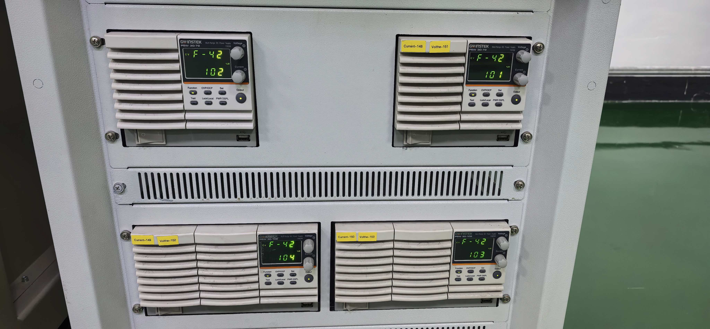

# GW Instek PSW 程控电源运维与调试手册

> 适用对象：EPB 测试台运维、设备调试与软件开发人员  
> 适用设备：GW Instek PSW 30-72、PSW 30-108  
> 文档状态：根据现场资料、项目代码和厂家公开资料整理；未完成实机回读的项目均标记为“待现场核验”  
> 更新日期：2026-07-29

## 1. 文档目的与证据边界

本手册用于统一现场程控电源的设备识别、网络连接、SCPI 调试、安全操作、共享供电风险判断和故障排查方法。它不能替代厂家安全说明，也不能替代现场电气图纸和经过批准的作业指导书。

资料可信度按以下顺序处理：

1. 厂家用户手册、编程手册和规格资料；
2. 现场设备照片及逐台执行 `*IDN?` 得到的回读；
3. 当前网络记录、项目配置和程序实现；
4. 历史调试截图与历史控制说明。

当不同来源发生冲突时，不直接选择某一方作为事实，而是记录冲突并要求现场回读。当前现场已验证电源原生 Socket 端口为 `2268`；历史记录和截图中的 `30000` 仅作为旧记录或代理/串口服务器端口留档，不作为当前直连端口。

## 2. 现场设备与主要规格

现场照片可以确认存在 PSW 30-72 和 PSW 30-108 两种型号。照片不能确认每台设备的序列号、固件版本和网络地址；这些信息必须逐台执行 `*IDN?` 后登记。



| 项目 | PSW 30-72 | PSW 30-108 |
|---|---:|---:|
| 类型 | Type II，多量程直流电源 | Type III，多量程直流电源 |
| 输出电压 | 0～30 V | 0～30 V |
| 输出电流 | 0～72 A | 0～108 A |
| 最大输出功率 | 720 W | 1080 W |
| 交流输入标称 | 100～240 Vac，47～63 Hz | 100～240 Vac，47～63 Hz |
| 最大输入标识 | 1000 VA MAX | 1500 VA MAX |
| 外形尺寸（宽×高×深） | 约 142×124×350 mm | 约 214×124×350 mm |
| 主机重量 | 约 5 kg（新版产品手册约 5.3 kg） | 约 7.5 kg |
| 冷却 | 内置风扇强制风冷 | 内置风扇强制风冷 |
| 标准远控接口 | LAN、USB Host/Device、模拟控制 | LAN、USB Host/Device、模拟控制 |
| 主要保护 | OVP、OCP、过温保护、关断保护 | OVP、OCP、过温保护、关断保护 |

### 2.1 多量程功率约束

型号中的最大电流和最大电压不能在所有工况下同时取得。任何设定都必须同时满足：

```text
0 ≤ VSET ≤ 30 V
0 ≤ ISET ≤ 额定最大电流
Vout × Iout ≤ 额定最大功率
```

例如在 24 V 输出附近，仅按功率上限估算：

- PSW 30-72 的输出电流理论上限约为 `720 W ÷ 24 V = 30 A`；
- PSW 30-108 的输出电流理论上限约为 `1080 W ÷ 24 V = 45 A`。

实际可用范围还受设备多量程工作曲线、保护设定、线损、温升和负载动态影响。现场调试不得只看电流额定值而忽略功率限制。

### 2.2 前面板识别

- `Voltage` 旋钮：设置电压。
- `Current` 旋钮：设置电流。
- `Set`：查看或设置电压、电流限制。
- `OVP/OCP`：设置过压、过流保护。
- `Output`：启停输出；输出有效时按键指示灯点亮。
- `Lock/Local`：锁定或恢复本地面板操作。
- `PWR DSPL`：切换 V/A、V/W 或 A/W 显示。
- `CV`：恒压工作状态。
- `CC`：恒流或达到电流限制状态。
- `RMT`：远程控制状态。
- `ALM`：保护或报警状态。
- 功率条：显示当前输出功率占额定功率的比例。

### 2.3 后面板识别

- 正、负输出端子；
- `+S`、`-S` Remote Sense 端子；
- 保护接地端；
- LAN 端口；
- USB-B 远控端口；
- 模拟控制/监视接口；
- 风扇和进、出风区域；
- 交流输入与序列号标签。

## 3. 安全要求

### 3.1 上电前

1. 确认型号、交流输入、保护接地和输出极性。
2. 确认输出端子、线缆、保险、继电器和连接器的额定电流不低于预期最大电流。
3. 使用适配的端子和防护罩，不允许用裸线临时搭接大电流输出。
4. 确认风道未被线束、面板或相邻设备遮挡。
5. 确认 Remote Sense 接法正确；不用远端补偿时必须按厂家要求保持本地 Sense 接法。
6. 在输出为 OFF 的状态下完成接线和极性复核。

### 3.2 运行中

- 运行环境应为室内、无阳光直射、低粉尘、非导电污染，环境温度 0～50 ℃、相对湿度 20%～85%、海拔低于 2000 m。
- 不得通过提高电流限制来掩盖卡钳堵转、接触不良或并发电流竞争。
- 出现 `ALM`、异常 `CC`、输出电压明显跌落、风扇异常、焦味或端子过热时，立即停止相关试验。
- Remote Sense 只能补偿线路压降，不能提升电源额定电压、功率或线缆容量。

### 3.3 断电与检修

1. 发送 `OUTP OFF` 并回读 `OUTP? = 0`。
2. 确认实测输出电压已降到安全水平。
3. 需要重新接线或拆机时，再断开交流输入。
4. 只有具备资质的人员才能拆机检修。

## 4. 现场网络与控制链路

### 4.1 当前记录

| 对象 | IP | 端口记录 | 状态 |
|---|---|---:|---|
| 控制电脑 | 192.168.1.100 | - | 来自当前 IP 记录 |
| 电源 1 | 192.168.1.101 | 2268 | 当前原生 Socket 端口；IP 待 `*IDN?` 绑定确认 |
| 电源 2 | 192.168.1.102 | 2268 | 同上 |
| 电源 3 | 192.168.1.103 | 2268 | 同上 |
| 电源 4 | 192.168.1.104 | 2268 | 同上 |

历史控制说明内的截图显示远端 `192.168.200.100:30000`，与当前 `192.168.1.x` 网段不是同一记录。不得把历史截图直接作为当前设备地址。

### 4.2 厂家原生 LAN Socket

根据 PSW Series Programming Manual v2：

- `F-36 = 1`：启用 LAN；
- `F-37 = 0`：使用静态地址，或设为 `1` 使用 DHCP；
- `F-39～F-42`：静态 IP 的四段；
- `F-43～F-46`：子网掩码的四段；
- `F-57 = 1`：启用 Socket Server；
- 原生 Socket 端口固定为 `2268`，不可配置；
- Socket 功能要求 PSW 固件 V1.12 或以上。

更改 LAN 参数后可能需要重启设备或刷新连接。现场设置前应先记录旧值，避免同时修改多台设备后无法定位。

### 4.3 历史 `30000` 端口记录

项目中曾存在三类 `30000` 记录：

1. 旧版 IP 表中四台电源均写为端口 `30000`；
2. 历史调试截图连接 `192.168.200.100:30000`；
3. 历史 `MTTfTest\App.config` 和旧程序使用 `127.0.0.1:30000`。

这些记录更像“本机服务、串口服务器或代理转发”，但目前没有代理服务的身份、协议转换规则和部署说明。当前直连应统一使用原生端口：

```text
直接连接：电源实际 IP:2268 → 发送 *IDN?
旧代理链路：仅在现场明确存在代理服务时，使用其记录的 IP:30000
当前验收：保存原生 2268 端口的响应、终止符、超时和错误返回
```

除非取得代理服务的身份、配置和协议，不得将 `30000` 作为当前连接端口，也不得用它替代原生 `2268` 进行验收。

## 5. SCPI 通信与快速调试

### 5.1 报文规则

- 命令不区分大小写，短格式用手册中大写字母部分表示。
- 查询命令以 `?` 结尾，发送后必须读取响应。
- 推荐每条命令以 `CR+LF` 结束；厂家 Realterm 示例同时启用 `+CR` 和 `+LF`。
- 一次只验证一条命令，确认响应后再进入下一步。
- 对设置命令必须执行回读和错误队列检查，不能把“Socket 发送成功”当作“设备设置成功”。

### 5.2 最小连接验证

```text
*IDN?
OUTP?
SOUR:VOLT?
SOUR:CURR?
MEAS:ALL:DC?
STAT:OPER:COND?
STAT:QUES:COND?
OUTP:PROT:TRIP?
SYST:ERR?
```

`*IDN?` 的典型响应格式为：

```text
GW-INSTEK,PSW-XXX-X,序列号,固件版本
```

只有型号、序列号和固件版本均已返回，才能把 IP 与现场设备资产绑定。

### 5.3 常用命令

| 目的 | 推荐命令 | 说明 |
|---|---|---|
| 设备身份 | `*IDN?` | 厂家、型号、序列号、固件 |
| 清状态 | `*CLS` | 清除标准状态数据；不等于清除保护跳闸 |
| 设置电压 | `SOUR:VOLT 12` | 示例为 12 V |
| 回读电压设定 | `SOUR:VOLT?` | 必须与期望值核对 |
| 设置电流 | `SOUR:CURR 20` | 示例为 20 A |
| 回读电流设定 | `SOUR:CURR?` | 必须与期望值核对 |
| 设置 OVP | `SOUR:VOLT:PROT 15` | 示例值必须按 DUT 确认 |
| 回读 OVP | `SOUR:VOLT:PROT?` | 核对保护设定 |
| 设置 OCP | `SOUR:CURR:PROT 25` | 示例值必须按 DUT 和线束确认 |
| 回读 OCP | `SOUR:CURR:PROT?` | 核对保护设定 |
| 开启输出 | `OUTP ON` | 开启前必须完成设定回读 |
| 关闭输出 | `OUTP OFF` | 安全停机首选命令 |
| 回读输出状态 | `OUTP?` | `0` 为关闭，`1` 为开启 |
| 实测电压 | `MEAS:VOLT:DC?` | 返回平均输出电压 |
| 实测电流 | `MEAS:CURR:DC?` | 返回平均输出电流 |
| 实测电压、电流 | `MEAS:ALL:DC?` | 返回格式为“电压,电流” |
| 实测功率 | `MEAS:POW:DC?` | 返回平均输出功率 |
| 保护状态 | `OUTP:PROT:TRIP?` | `1` 表示保护已触发 |
| 清保护 | `OUTP:PROT:CLE` | 仅在故障原因排除后使用 |
| 错误队列 | `SYST:ERR?` | 最多保存 32 个错误；重复读取直到无错误 |
| 自检 | `*TST?` | `0` 表示未发现自检错误 |

表中的电压、电流和保护值仅为命令格式示例，不是 EPB 试验推荐参数。

### 5.4 CV、CC 与限制状态

查询：

```text
STAT:OPER:COND?
```

返回值按位解释：

- 位 8，权值 `256`：CV，恒压模式；
- 位 10，权值 `1024`：CC，恒流模式；
- 位 11，权值 `2048`：输出开启延时；
- 位 12，权值 `4096`：输出关闭延时。

查询：

```text
STAT:QUES:COND?
```

关键状态位：

- `1`：OVP 已触发；
- `2`：OCP 已触发；
- `16`：过温保护已触发；
- `256`：达到电压限制；
- `512`：达到电流限制；
- `2048`：关断报警；
- `4096`：达到功率限制。

若同一次返回中有多个位被置位，应使用按位与运算分别判断，不能只用等值比较。

## 6. 标准上电、调试与关机流程

### 6.1 首次接入

1. 输出保持 OFF，完成保护接地、极性、线径、端子和风道检查。
2. 读取面板型号和序列号标签。
3. 通过原生 `IP:2268` 建立连接。
4. 发送 `*IDN?`，保存完整原始响应。
5. 读取 `OUTP?`、`SOUR:VOLT?`、`SOUR:CURR?`、OVP/OCP、状态寄存器和错误队列。
6. 将 IP、型号、序列号、固件和电源组绑定到资产表。
7. 未确认身份或回读异常时，不允许启动批量试验。

### 6.2 参数设置

1. `OUTP OFF`，并确认 `OUTP? = 0`。
2. 设置 OVP、OCP，并立即回读。
3. 设置电压、电流，并立即回读。
4. 查询 `SYST:ERR?`，清空并记录所有错误。
5. 再次检查输出端接线和 EPB 分组。
6. `OUTP ON`，确认 `OUTP? = 1`。
7. 读取 `MEAS:ALL:DC?`、CV/CC 和 Questionable 状态。

### 6.3 运行监控

每次试验至少记录：

- UTC 或统一时基时间戳；
- 电源编号、IP、型号、序列号和固件；
- VSET、ISET、OVP、OCP；
- 实测 V/I/P；
- `OUTP?`；
- CV/CC；
- 电压限制、电流限制、功率限制及保护状态；
- 各 EPB 支路电流、DO 命令和继电器反馈；
- 错误队列原始文本。

### 6.4 正常关机

1. 停止向 EPB 发送动作命令。
2. `OUTP OFF`。
3. 回读输出状态和实测电压。
4. 等待负载与电源内部能量释放完成。
5. 保存最终状态、错误队列和试验日志。
6. 需要断开接线时再切断交流输入。

## 7. 共享供电与电流竞争

一台电源给多个 EPB 支路供电时：

```text
Iout = Ibranch1 + Ibranch2 + ... + IbranchN
```

当并发支路总需求超过 ISET 或功率上限时，电源可能进入 CC 或功率限制，输出电压随之下降。电源只限制总输出，不会保证各支路平均分配电流。支路电流由电机反电势、线阻、触点压降、机构负载和动作相位共同决定。

运维要求：

- 容量未验证前，同一电源组内的高电流阶段应错峰或互斥。
- 不得把总电源限流当作每个支路的短路、堵转保护。
- 线束、保险、继电器、连接器和端子的允许电流必须逐项核对。
- 进入异常 CC、功率限制或明显压降时，应停止共享该电源的相关通道并留存状态。
- 新的 ISET 必须根据单支路峰值、并发实测、最坏温度和安全裕量确定，不能只为跨过软件电流阈值而提高。

## 8. Remote Sense 与大电流接线

Remote Sense 用于补偿输出端到负载端之间的线路压降。30 V 型号每根 Sense 线的补偿能力按厂家规格为 0.6 V。

使用要求：

1. Sense 线必须直接取样负载端电压，不得与大电流线共用不可靠触点。
2. Sense 线应绞合、远离强干扰线束，并按厂家接线图保持极性。
3. 主输出线必须独立承担全部负载电流，Sense 线不得承载负载电流。
4. 不使用 Remote Sense 时，按厂家要求将 `+S`、`-S` 保持在本地 Sense 接法。
5. Sense 线断开、反接或接触不良可能导致输出异常，首次启用必须从低电压、低电流开始验证。
6. Remote Sense 不能补偿超过规格的线损；压降过大应增大线径、缩短线缆或改善触点。

## 9. 历史资料、当前代码与厂家标准差异

| 项目 | 历史资料/当前实现 | 厂家 PSW 标准 | 结论与动作 |
|---|---|---|---|
| 设备模型 | 历史说明含负电流、负功率和负载模式 | PSW 30-72/30-108 为单向直流电源 | 历史命令明显来自其他设备或代理协议，不得直接套用 |
| 远程命令 | `SYST:REM`、`FUNC VOLT` | 官方使用标准 PSW SCPI；远控状态可用 `SYST:COMM:RLST`（固件要求适用） | 逐条以 `SYST:ERR?` 和回读验证 |
| 电流限制 | `CURR:LIM`、`CURR:LIM:NEG` | `SOUR:CURR` 与 `SOUR:CURR:PROT` | 负电流不适用于现场 PSW；待确认代理是否转换 |
| 功率限制 | `POW:LIM ±10000 W` | 设备受 720 W/1080 W 额定功率约束，状态可查询功率限制位 | 10000 W 与现场型号不符 |
| 电压配置 | `Voltage=50` | 两种现场型号均为 0～30 V | 当前配置超范围，批量运行前必须修正或确认配置未作用于 PSW |
| 电流配置 | `MaxCurrent=20`、`MinCurrent=-20` | 输出电流为非负设定 | `20 A` 可作为候选上限，但必须回读；`-20 A` 不适用 |
| 网络端口 | 当前现场 `192.168.1.101～104:2268` | 原生 Socket 固定 `:2268` | 逐台验证 TCP 与 `*IDN?`；旧 `30000` 仅作历史/代理记录 |
| 多台设备 | 程序只发现一个逻辑 `AsyncTcpClient` 电源客户端 | 现场记录四台电源 | 当前软件可能只连代理或没有逐台监控，待架构确认 |
| 响应处理 | `powerDataReceived` 未处理设备响应 | 查询必须读取并解释返回值 | 增加身份、设定、实测、状态和错误闭环后才能证明控制生效 |
| 输出启停 | `OUTP 1/0` | `OUTP ON/OFF` 或 `OUTP 1/0` 均有效 | 命令本身兼容，但仍需 `OUTP?` 回读 |
| 历史地址 | `192.168.200.100:30000` | 当前记录为 `192.168.1.101～104` | 不是同一网络记录，不得混用 |

## 10. 常见故障排查

| 现象 | 优先检查 | 处理原则 |
|---|---|---|
| Socket 无法连接 | IP、掩码、网线、F-36、F-57、固件、端口 | 先验证 `IP:2268`；不要默认尝试旧 `30000` |
| 能连接但无响应 | CR/LF、查询读取、超时、代理协议 | 用 `*IDN?` 单命令测试并保存十六进制收发 |
| 返回 Command error | 命令不属于 PSW、空格/参数错误、代理未转换 | 读取 `SYST:ERR?`；按官方命令树改写 |
| 输出无法开启 | OVP/OCP/过温/关断保护、外部控制 | 查 `OUTP:PROT:TRIP?` 与 `STAT:QUES:COND?`，排除原因后再清保护 |
| 频繁进入 CC | ISET 太低、并发峰值、支路短路或堵转 | 分离支路，检查单路峰值，再验证错峰策略 |
| 电压下降但电流未到额定最大值 | 达到功率限制、线损或交流输入异常 | 查功率限制位、V/I/P 与端子压降 |
| 面板显示与软件设定不同 | 命令未生效、控制源不同、未回读 | 对比 `SOUR:VOLT?`、`SOUR:CURR?`、面板和错误队列 |
| 输出关闭后电压下降慢 | 负载特性、Bleeder 设置、输出电容 | 等待实测降到安全值，不凭固定延时判定 |
| USB 不稳定 | 驱动、VISA 冲突、USB 接口问题 | 参考官方 USB 应用说明；优先评估 LAN 控制 |

## 11. 现场调试记录表

### 11.1 设备资产

| 电源编号 | 现场位置 | IP | 连接端口 | `*IDN?` 原始响应 | 电源组/EPB 通道 | 核验人/日期 |
|---|---|---|---:|---|---|---|
| 1 |  | 192.168.1.101 |  |  |  |  |
| 2 |  | 192.168.1.102 |  |  |  |  |
| 3 |  | 192.168.1.103 |  |  |  |  |
| 4 |  | 192.168.1.104 |  |  |  |  |

### 11.2 参数与回读

| 时间 | 电源 | VSET/回读 | ISET/回读 | OVP/OCP | 实测 V/I/P | CV/CC | 限制/保护位 | 错误队列 | 结果 |
|---|---|---|---|---|---|---|---|---|---|
|  |  |  |  |  |  |  |  |  |  |

## 12. 验收清单

- [ ] 四台设备均已通过 `*IDN?` 绑定型号、序列号、固件和 IP。
- [ ] 四台设备均已确认使用原生 `2268`；若仍保留 `30000`，已取得代理服务的身份、配置和协议。
- [ ] 所有有效电压设置均不超过 30 V。
- [ ] 不再把负电流、负功率或双向负载命令直接发给 PSW。
- [ ] 上电前自动或人工读取 VSET、ISET、OVP、OCP、输出状态和错误队列。
- [ ] 运行中记录实测 V/I/P、CV/CC、限制位、保护位和各支路电流。
- [ ] 同一电源组的高电流动作已通过容量验证或实施可靠错峰。
- [ ] 线缆、端子、保险、继电器和连接器容量均有记录。
- [ ] Remote Sense 接法经过低功率验证。
- [ ] 通信中断、保护触发、异常 CC 和电压跌落均能安全停机并留存证据。
- [ ] 单路、双路/多路、故障注入和回归试验均有可追溯记录。

## 13. 参考资料

本目录已保存以下厂家原始资料，文件哈希和下载地址见 [`官方资料/README.md`](官方资料/README.md)：

- [`PSW Series User Manual Rev. N`](官方资料/核心手册/UM_PSW_EN_Rev_N_20220906.pdf)
- [`PSW Series Programming Manual Ver. 2`](官方资料/核心手册/PSW_programming_manual_EN_Ver_2_20241104-1.pdf)
- [`PSW Quick Start Guide`](官方资料/核心手册/GW-PSW_QSG_EN.pdf)
- [`PSW Series Brochure`](官方资料/核心手册/BH_PSW-Series_E_202607.pdf)

官方网站：

- 产品页：<https://www.gwinstek.com/en-US/products/detail/PSW-Series>
- 编程手册：<https://www.gwinstek.com/en-global/download/downloadFile/6624>
- 下载检索：<https://www.gwinstek.com/en-global/download/index?cate=93&down=0&key=PSW&ser=0&subcate=0>

## 14. 待现场核验项

1. 四台设备的实际型号分布、序列号和固件版本；
2. IP `192.168.1.101～104` 与物理电源编号、EPB 分组的对应关系；
3. 历史 `30000` 端口是否仍有代理服务，以及其部署主机、启动方式和协议转换规则；
4. 当前有效 VSET、ISET、OVP、OCP 和输出模式；
5. 现场是否使用 Remote Sense，以及 Sense 线实际接点；
6. 每个电源组的线缆、保险、继电器、连接器容量；
7. 单路与并发工况下的峰值电流、功率限制和温升；
8. 程序是否仍执行 `MTTfTest\Main_Frm.cs` 中的历史电源初始化逻辑。
